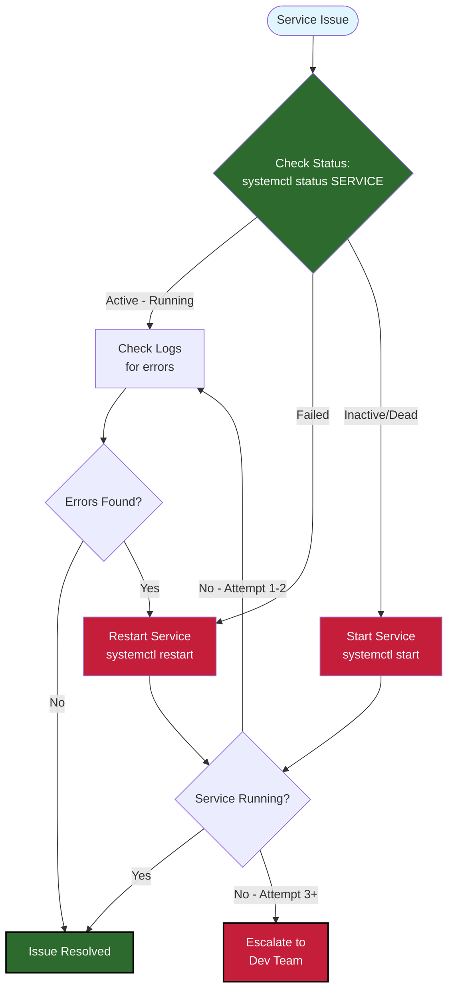

# SOP-001: VPS Service Management

**Version:** 1.0 | **Owner:** System Operator | **Review Date:** 2026-12-08

---

## Purpose

This procedure ensures reliable operation of the Triple Screen trading system by defining how to manage the three core systemd services running on the Ubuntu VPS. Proper service management prevents trading downtime, data loss, and missed trading opportunities. Follow these procedures to monitor service health, restart failed services, and diagnose operational issues.

---

## Scope

**When to use this SOP:**
- Daily health checks of trading system services
- Restarting services after configuration changes or updates
- Diagnosing service failures or performance degradation
- Recovering from VPS reboots or network interruptions
- Investigating trading execution delays or dashboard unavailability

**When NOT to use:**
- Deploying code changes (see SOP-003: Code Deployment)
- Database maintenance (see SOP-004: Database Operations)
- Emergency trading halts (see SOP-009: Emergency Procedures)

---

## Prerequisites

Before starting, ensure you have:
-  SSH access to VPS (IP address and credentials)
-  Sudo privileges on VPS (user: `triple-screen`)
-  Understanding of systemd service architecture
-  Familiarity with Triple Screen service dependencies (orchestrator requires API and dashboard)

---

## Service Troubleshooting Flowchart

Use this visual guide to quickly diagnose and resolve service issues:



**Quick Reference:**
- **Active but errors**: Check logs → Restart → Verify
- **Failed**: Restart → Check logs if fails again
- **Inactive**: Start → Verify success
- **3+ restart failures**: Escalate to development team

---

## Procedure

### Step 1: Check Service Status

1. SSH into the VPS:
   ```bash
   ssh triple-screen@your-vps-ip
   ```

2. Check all Triple Screen services:
   ```bash
   sudo systemctl status triple-screen-orchestrator
   sudo systemctl status triple-screen-dashboard
   ```

   **Expected output for healthy service:**
   ```
   ● triple-screen-orchestrator.service - Triple Screen Live Trading Orchestrator
        Loaded: loaded (/etc/systemd/system/triple-screen-orchestrator.service; enabled)
        Active: active (running) since Mon 2026-09-08 09:00:00 UTC; 2h 15min ago
      Main PID: 12345 (python)
         Tasks: 8 (limit: 4915)
        Memory: 450.2M (max: 1.0G)
           CPU: 5min 32s
        CGroup: /system.slice/triple-screen-orchestrator.service
                └─12345 /opt/triple-screen/.venv/bin/python -m src.strategies.triple_screen.live.run_orchestrator
   ```

3. Verify all three services show `Active: active (running)`.

 **Success criteria**: All services show green "active (running)" status with uptime greater than 5 minutes.

---

### Step 2: Monitor Service Logs in Real-Time

1. View orchestrator logs (main trading logic):
   ```bash
   sudo journalctl -u triple-screen-orchestrator -f
   ```

   For file-based logs:
   ```bash
   tail -f /var/log/triple-screen/orchestrator.log
   ```

2. View dashboard logs (Streamlit UI):
   ```bash
   sudo journalctl -u triple-screen-dashboard -f
   ```

   **Stop following logs**: Press `Ctrl+C`

   **Expected output (normal operation):**
   ```
   Sep 08 11:23:45 INFO: Market check completed - OPEN
   Sep 08 11:23:50 INFO: Position monitoring cycle complete
   Sep 08 11:24:00 INFO: Scanning for new signals...
   ```

4. Look for error patterns:
   - `ERROR:` lines indicate failures
   - `CRITICAL:` lines require immediate attention
   - `WARNING:` lines may indicate degraded performance

 **Success criteria**: Logs show regular activity with no ERROR or CRITICAL messages in the last 15 minutes.

---

### Step 3: Check Resource Usage

1. View memory usage for all services:
   ```bash
   sudo systemctl status triple-screen-orchestrator | grep Memory
   sudo systemctl status triple-screen-dashboard | grep Memory
   ```

   **Expected ranges:**
   - Orchestrator: 300-800 MB (max: 1 GB)
   - Dashboard: 200-600 MB (max: 1 GB)

2. View CPU usage:
   ```bash
   sudo systemctl status triple-screen-orchestrator | grep CPU
   sudo systemctl status triple-screen-dashboard | grep CPU
   ```

   **Expected behavior:**
   - All services should show cumulative CPU time (not live percentage)
   - High CPU time (>30 min/day) may indicate performance issues

3. Check overall system resources:
   ```bash
   htop
   ```
   Press `q` to quit.

 **WARNING**: If any service exceeds 90% of its memory limit, restart immediately (Step 4) to prevent OOM kills.

 **Success criteria**: All services running within memory limits, no processes using >80% CPU continuously.

---

### Step 4: Restart a Service (Planned Maintenance)

Use this procedure for routine restarts after configuration changes or when experiencing degraded performance.

1. Restart the orchestrator (main trading service):
   ```bash
   sudo systemctl restart triple-screen-orchestrator
   ```

2. Verify restart succeeded:
   ```bash
   sudo systemctl status triple-screen-orchestrator
   ```

   **Expected output:**
   ```
   Active: active (running) since Mon 2026-09-08 14:30:15 UTC; 5s ago
   ```

3. Check logs for clean startup:
   ```bash
   sudo journalctl -u triple-screen-orchestrator -n 50
   ```

   **Expected startup sequence:**
   ```
   INFO: Loading configuration from /opt/triple-screen/backend/.env.production
   INFO: Database connection established
   INFO: Market data connection initialized
   INFO: Orchestrator started successfully
   ```

4. Repeat for dashboard if needed:
   ```bash
   sudo systemctl restart triple-screen-dashboard
   ```

 **Success criteria**: Service shows "active (running)" status within 30 seconds, logs show successful initialization.

---

### Step 5: Stop a Service (Emergency Only)

 **WARNING**: Stopping the orchestrator will halt all automated trading. Only use during critical failures or emergency market conditions.

1. Stop the service:
   ```bash
   sudo systemctl stop triple-screen-orchestrator
   ```

2. Verify service stopped:
   ```bash
   sudo systemctl status triple-screen-orchestrator
   ```

   **Expected output:**
   ```
   Active: inactive (dead) since Mon 2026-09-08 14:35:00 UTC; 2s ago
   ```

3. To restart after emergency:
   ```bash
   sudo systemctl start triple-screen-orchestrator
   ```

 **NOTE**: Services configured with `Restart=always` will auto-restart after crashes. Manual stops prevent auto-restart until you run `start` command.

 **Success criteria**: Service status shows "inactive (dead)", no process appears in `htop`.

---

### Step 6: View Historical Logs

1. View last 100 lines of orchestrator logs:
   ```bash
   sudo journalctl -u triple-screen-orchestrator -n 100
   ```

2. View logs from specific time range:
   ```bash
   sudo journalctl -u triple-screen-orchestrator --since "2026-09-08 09:00" --until "2026-09-08 12:00"
   ```

3. View logs from today only:
   ```bash
   sudo journalctl -u triple-screen-orchestrator --since today
   ```

4. Search logs for specific errors:
   ```bash
   sudo journalctl -u triple-screen-orchestrator | grep "ERROR"
   ```

5. For file-based logs (orchestrator only):
   ```bash
   # Standard output logs
   cat /var/log/triple-screen/orchestrator.log

   # Error logs
   cat /var/log/triple-screen/orchestrator-error.log
   ```

💡 **TIP**: Pipe journalctl output to `less` for easier navigation: `sudo journalctl -u triple-screen-orchestrator | less`

 **Success criteria**: Successfully retrieve and review logs from target timeframe.

---

### Step 7: Enable/Disable Auto-Start on Boot

1. Verify current auto-start status:
   ```bash
   sudo systemctl is-enabled triple-screen-orchestrator
   sudo systemctl is-enabled triple-screen-dashboard
   ```

   **Expected output:** `enabled` (all services should auto-start)

2. To disable auto-start (if temporarily decommissioning):
   ```bash
   sudo systemctl disable triple-screen-orchestrator
   ```

3. To re-enable auto-start:
   ```bash
   sudo systemctl enable triple-screen-orchestrator
   ```

 **NOTE**: Disabling auto-start does NOT stop running services - it only prevents startup on next reboot.

 **Success criteria**: `is-enabled` command returns expected status (`enabled` or `disabled`).

---

## Verification

After completing any service management operation, verify system health by:

1. **All services running:**
   ```bash
   sudo systemctl is-active triple-screen-orchestrator triple-screen-dashboard
   ```
   **Expected output:** `active` for both services

2. **Dashboard accessible:**
   - Open browser to: `http://your-vps-ip:8501`
   - Verify page loads and shows live data

3. **Orchestrator processing trades:**
   - Check logs for regular "Market check" and "Scanning for signals" messages
   - Verify no ERROR messages in last 5 minutes

**Expected results:**
-  All services show "active" status
-  Dashboard loads without errors
-  Orchestrator logs show normal trading activity

---

## Troubleshooting

| Problem | Possible Cause | Solution |
|---------|---------------|----------|
| Service status shows "failed" | Service crashed during startup | Check logs: `sudo journalctl -u triple-screen-orchestrator -n 100` <br> Look for Python exceptions or configuration errors <br> Fix root cause, then: `sudo systemctl restart triple-screen-orchestrator` |
| Service status shows "activating" for >60 seconds | Service stuck in startup loop | Check if PostgreSQL is running: `sudo systemctl status postgresql` <br> If DB down, start it: `sudo systemctl start postgresql` <br> Restart service: `sudo systemctl restart triple-screen-orchestrator` |
| Memory exceeds limit (approaching 1G for orchestrator) | Memory leak or high market activity | Restart service immediately: `sudo systemctl restart triple-screen-orchestrator` <br> Monitor memory trend over next hour <br> If repeats, escalate to developer |
| Logs show "Connection refused" errors | Dependency service not running | Check dashboard status: `sudo systemctl status triple-screen-dashboard` <br> Start dashboard if stopped: `sudo systemctl start triple-screen-dashboard` <br> Restart orchestrator: `sudo systemctl restart triple-screen-orchestrator` |
| After restart, service immediately shows "failed" | Configuration file error or missing dependencies | Check systemd service file: `sudo systemctl cat triple-screen-orchestrator` <br> Verify working directory exists: `ls -la /opt/triple-screen/backend` <br> Verify environment file: `ls -la /opt/triple-screen/.env.production` <br> Check Python virtual environment: `ls -la /opt/triple-screen/.venv` |
| Logs show "Permission denied" errors | File permissions incorrect | Check log directory: `ls -la /var/log/triple-screen/` <br> Fix ownership: `sudo chown -R triple-screen:triple-screen /var/log/triple-screen/` <br> Restart service: `sudo systemctl restart triple-screen-orchestrator` |

**Escalation:**
- If service fails to start after 3 restart attempts → Contact development team with full logs
- Critical failures during market hours → Execute emergency trading halt (SOP-009)
- Database connection errors persisting >10 minutes → Check database health (SOP-004)

---

## Rollback

If a service restart causes issues, rollback to previous stable state:

1. **Stop the failing service immediately:**
   ```bash
   sudo systemctl stop triple-screen-orchestrator
   ```

2. **Check if recent configuration changes were deployed:**
   ```bash
   cd /opt/triple-screen/backend
   git log -n 5
   ```

3. **If configuration changed in last deployment, revert:**
   ```bash
   # View recent commits
   git log --oneline -n 10

   # Revert to previous commit (replace COMMIT_HASH)
   git checkout COMMIT_HASH
   ```

4. **Restore previous environment file if changed:**
   ```bash
   sudo cp /opt/triple-screen/.env.production.backup /opt/triple-screen/.env.production
   ```

5. **Restart service with previous configuration:**
   ```bash
   sudo systemctl start triple-screen-orchestrator
   ```

6. **Verify successful rollback:**
   ```bash
   sudo systemctl status triple-screen-orchestrator
   sudo journalctl -u triple-screen-orchestrator -n 50
   ```

**When to rollback:**
- Service fails to start after configuration change
- Service crashes repeatedly (>3 times in 5 minutes)
- Logs show critical errors not present before restart
- Trading execution errors occur immediately after restart

 **WARNING**: Always create configuration backups before making changes. Document rollback in incident log for post-mortem analysis.

---

## Related Documents

- SOP-002: Daily Data Refresh Procedures
- SOP-003: Code Deployment and Updates
- SOP-004: Database Operations
- SOP-009: Emergency Trading Halt Procedures
- Reference: VPS Commands Quick Reference Card (docs/reference/)

---

## Change Log

| Date | Version | Author | Changes |
|------|---------|--------|---------|
| 2026-09-08 | 1.0 | IB | Initial creation - documented three core systemd services |
