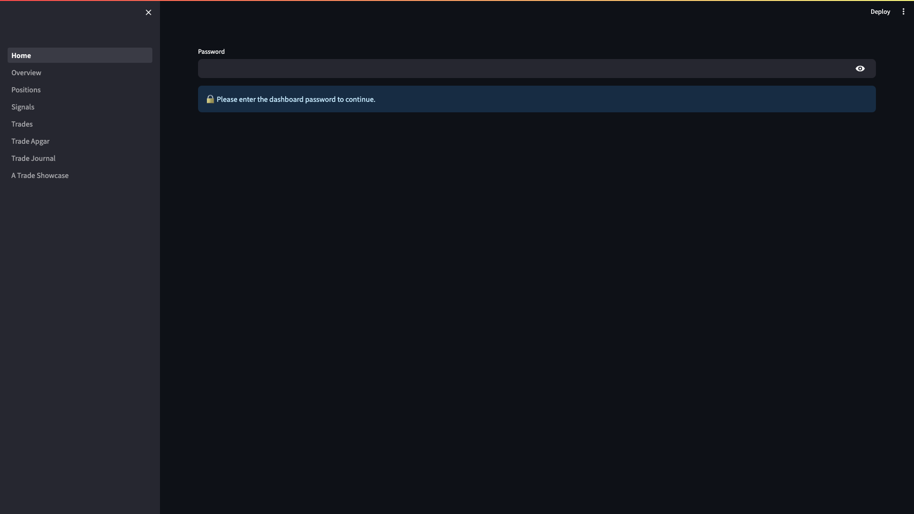
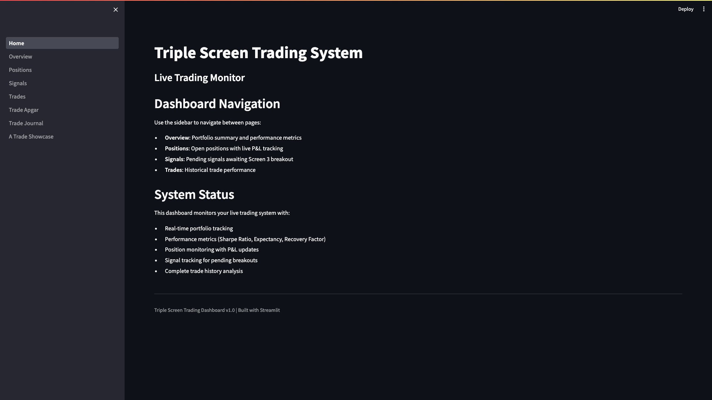

# Dashboard Access and Navigation

**Version:** 1.0 | **Last Updated:** 2026-09-08 | **Audience:** All Users

---

## Overview

The Triple Screen Trading Dashboard is a web-based interface for monitoring your live trading system. Built with Streamlit, it provides real-time portfolio tracking, performance metrics, position monitoring, and comprehensive trade documentation.

**Use this guide to:**
- Access the dashboard locally or in production
- Navigate between dashboard pages
- Understand what information each page displays
- Manage your login session

---

## Quick Start

**Goal:** Access the dashboard and view your portfolio in 3 steps

1. Open your web browser and navigate to:
   - **Local:** `http://localhost:8501`
   - **Production:** `https://trading.tradingwars.app`

2. Enter the dashboard password when prompted

3. Click **Overview** in the sidebar to view portfolio summary

**Result:** You'll see your portfolio metrics, performance statistics, and market classification

---

## Step-by-Step Instructions

### Task 1: Access the Dashboard

**Purpose:** Connect to the dashboard web interface

**Steps:**

1. **Local Development Access**

   If running the dashboard on your local machine:

   ```bash
   # Navigate to dashboard directory
   cd backend/dashboard

   # Start Streamlit server
   streamlit run Home.py
   ```

   **Look for:** Terminal message showing `Local URL: http://localhost:8501`

2. **Open in Browser**

   Navigate to the appropriate URL:
   - **Local:** `http://localhost:8501`
   - **Production:** `https://trading.tradingwars.app`

   **Look for:** Triple Screen Trading System login page with password input field

   

**Result:** Browser displays the login page with a password input field and lock icon

---

### Task 2: Login to Dashboard

**Purpose:** Authenticate and gain access to trading data

**Steps:**

1. **Enter Password**

   Type the dashboard password into the password field (characters will be hidden)

   **Look for:** Text input field labeled "Password" with bullet points hiding your input

2. **Submit Password**

   Press `Enter` or click outside the password field to submit

   **Look for:** One of two outcomes:
   - **Success:** Page refreshes and displays "Triple Screen Trading System" homepage
   - **Failure:** Red error message "Password incorrect. Please try again."

3. **If Password Incorrect**

   Re-enter the correct password in the input field that remains visible

   **Look for:** Password field remains active for retry attempts

**Result:** After successful login, you see the Home page with navigation menu in sidebar



---

### Task 3: Navigate Between Dashboard Pages

**Purpose:** Access different views and functionalities

**Steps:**

1. **Locate Sidebar Navigation**

   The navigation menu is on the left side of the screen

   **Look for:** Vertical list of page names with icons in a gray sidebar panel

2. **Select a Page**

   Click any page name in the sidebar:
   - **Home** - Welcome page with quick navigation guide
   - **Overview** - Portfolio summary and performance metrics
   - **Positions** - Open positions with live P&L tracking
   - **Signals** - Pending signals awaiting Screen 3 breakout
   - **Trades** - Historical trade performance and analysis
   - **Trade Apgar** - Post-entry trade quality scoring
   - **Trade Journal** - Post-exit trade documentation
   - **A Trade Showcase** - Reference A-grade trade display

   **Look for:** Selected page name highlighted in sidebar, page content loads in main area

3. **Navigate Between Pages**

   Click different page names to switch views - your login session persists across all pages

   **Look for:** Each page displays its title at the top (e.g., "Portfolio Overview", "Pending Signals")

**Result:** You can freely navigate between all dashboard pages without re-authenticating

---

### Task 4: Understand Page Functions

**Purpose:** Know which page to use for different tasks

**Overview of Pages:**

#### **Home Page**
- **Displays:** Welcome message and navigation instructions
- **Use when:** First logging in or needing quick orientation
- **Key features:** System status overview, navigation guide

#### **Overview Page**
- **Displays:** Portfolio summary, performance metrics, market classification
- **Use when:** Checking overall account health and performance
- **Key features:**
  - Market Type classification (Van K. Tharp methodology)
  - Total equity, cash balance, position count
  - Performance metrics: Total Return %, Win Rate, Sharpe Ratio, Recovery Factor
  - Portfolio heat (total risk exposure)
  - Equity curve chart

#### **Positions Page**
- **Displays:** All currently open positions with detailed Trade Bill format
- **Use when:** Monitoring active trades and live profit/loss
- **Key features:**
  - Trade Bill with 4 sections: Identification, Apgar, Entry Setup, After Entry
  - Entry charts and market context
  - Partial exits and stop loss movements
  - Commission tracking
  - Real-time P&L calculation

#### **Signals Page**
- **Displays:** Pending signals awaiting Screen 3 breakout confirmation
- **Use when:** Managing watchlist and reviewing potential entries
- **Key features:**
  - Manual watchlist management (add/remove symbols)
  - Pending signals table with grade, entry price, stop loss
  - Position sizing and risk metrics
  - Expiration status tracking
  - Signal cancellation capability

#### **Trades Page**
- **Displays:** Complete historical trade performance
- **Use when:** Analyzing past trades and performance patterns
- **Key features:**
  - Full trade history with Apgar scores
  - Advanced filtering (by Apgar score, exit tactic, review status, A-trades only)
  - Expandable Trade Bill details for each trade
  - Performance analytics comparing A-trades vs non-A-trades
  - CSV export functionality

#### **Trade Apgar Page**
- **Displays:** Trade quality scoring interface
- **Use when:** Scoring new trades post-entry (within first week)
- **Key features:**
  - 5-criteria scoring form (0-10 total points)
  - Market context documentation (earnings dates, dividend dates)
  - Entry rationale text field
  - Entry chart upload capability
  - List of unscored trades requiring attention

#### **Trade Journal Page**
- **Displays:** Post-exit trade documentation workflow
- **Use when:** Documenting trade exits and conducting post-trade reviews
- **Key features:**
  - Section A: Reason for Entry (pre-filled from Trade Bill)
  - Section B: Entry/Exit Documentation (auto-populated)
  - Section C: Reason for Exit (manual entry + chart upload)
  - Section D: Exit Tactic (dropdown: target hit, stopped out, etc.)
  - Section E: Post-Trade Review (2+ months after exit)

#### **A Trade Showcase Page**
- **Displays:** Reference A-grade trade from backtest (VLO example)
- **Use when:** Studying high-quality trade setups and documentation standards
- **Key features:**
  - Complete Trade Bill for reference trade
  - Full Apgar scoring breakdown
  - Entry and exit charts
  - Example of ideal trade documentation

**Result:** You know which page to use for each task in your trading workflow

---

## Tips & Best Practices

💡 **Tip:** Bookmark the production URL (`https://trading.tradingwars.app`) for quick access

💡 **Tip:** Keep the Overview page open in one browser tab and other pages in separate tabs for multi-tasking

💡 **Tip:** Use the Signals page daily to review potential entries and manage your watchlist

💡 **Tip:** Score trades on the Trade Apgar page within 24 hours of entry while setup details are fresh

 **Common Mistake:** Forgetting to refresh the page after long idle periods - performance metrics update on page load, not automatically

---

## Troubleshooting

**Problem:** Cannot access dashboard at localhost:8501

**Solution:**
1. Verify Streamlit server is running: `ps aux | grep streamlit`
2. Start server if not running: `cd backend/dashboard && streamlit run Home.py`
3. Check firewall settings allow port 8501
4. Try alternative URL: `http://127.0.0.1:8501`

**Problem:** Password accepted but pages show no data

**Solution:**
1. Verify database connection is active
2. Check database contains data: `SELECT COUNT(*) FROM positions;`
3. Review backend logs for connection errors
4. Restart Streamlit server to refresh database connection

**Problem:** Navigation sidebar not visible on mobile device

**Solution:**
1. Look for hamburger menu icon (≡) in top-left corner
2. Tap icon to expand navigation sidebar
3. Select page, sidebar auto-collapses after selection
4. For better experience, use landscape orientation or desktop browser

**Problem:** Session expires during use

**Solution:**
1. Streamlit sessions persist as long as browser tab stays open
2. If logged out unexpectedly, refresh page and re-enter password
3. Check browser isn't clearing session storage automatically
4. Avoid opening dashboard in private/incognito mode (session storage limited)

---

## FAQ

**Q: Do I need to logout when finished using the dashboard?**

A: No explicit logout is required. Simply close the browser tab. However, for shared computers, clear browser cache or use private browsing mode.

**Q: How often do performance metrics update?**

A: Metrics refresh each time you navigate to a page or manually refresh your browser. The dashboard does not auto-refresh - this prevents unnecessary database queries and preserves server resources.

**Q: Can multiple users access the dashboard simultaneously?**

A: Yes, multiple browser sessions can access the dashboard concurrently. Each session maintains independent state. All users share the same password.

**Q: Which page should I check first each trading day?**

A: Start with **Overview** to check market type and portfolio heat, then **Signals** to review pending entries, then **Positions** to monitor open trades.

**Q: Where do I find the dashboard password?**

A: The password is stored in `.streamlit/secrets.toml` under `passwords.admin_password`. For production deployments, it's set in Streamlit Cloud secrets management. Contact the system administrator if you don't have access.

---

## Related Guides

**Next Steps:**
- **GUIDE-002:** Managing Pending Signals and Watchlist (coming soon)
- **GUIDE-003:** Trade Apgar Scoring System (coming soon)
- **GUIDE-004:** Trade Journal Best Practices (coming soon)

**Prerequisites:**
- **SOP-001:** Daily Data Refresh (for understanding data currency)
- Access credentials for dashboard

---

## Glossary

| Term | Definition |
|------|------------|
| **Dashboard** | Web-based interface for viewing and managing trading system (Streamlit application) |
| **Signal** | Trade opportunity that has passed Screen 1 and Screen 2, awaiting Screen 3 breakout |
| **Trade Bill** | Comprehensive trade documentation format with identification, setup, and execution details |
| **Apgar Score** | Post-entry trade quality score (0-10 points) based on 5 criteria |
| **Portfolio Heat** | Total percentage of account at risk across all open positions |
| **Position Sizing** | Shares to buy calculated from account equity, risk percentage, and stop distance |
| **R-multiple** | Profit or loss measured in units of initial risk (1R = distance from entry to initial stop) |
| **Screen 1/2/3** | Triple Screen Trading System filters: Screen 1 (trend), Screen 2 (oscillator), Screen 3 (breakout) |
| **Market Type** | Van K. Tharp classification combining direction (bull/bear/sideways) and volatility (quiet/normal/volatile) |

---

## Change Log

| Date | Version | Author | Changes |
|------|---------|--------|---------|
| 2026-09-08 | 1.0 | Claude | Initial creation - dashboard access, navigation, and page overview |

---

**Document Owner:** Ian Butler
**Next Review:** 2026-12-08
**Feedback:** Open GitHub issue or contact via project channels
