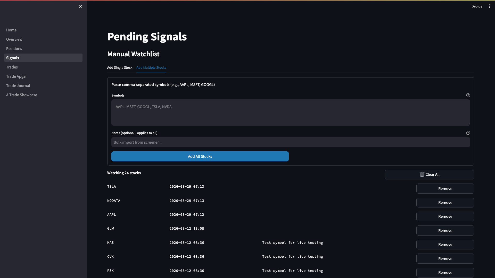
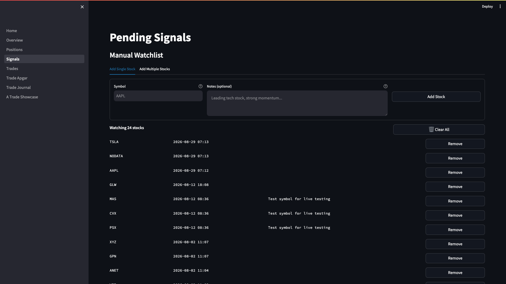

# Weekly Watchlist Management User Guide

**Version:** 1.0 | **Last Updated:** 2026-09-08 | **Audience:** Triple Screen Traders

---

## Overview

The manual watchlist is the foundation of your weekly Triple Screen workflow. Every weekend, you scan the market for stocks with strong relative strength, then update your watchlist with the best candidates. The system monitors these stocks for Screen 1 (weekly trend) and Screen 2 (daily pullback) signals.

**Use this guide to:**
- Run the weekly relative strength scan
- Generate comma-separated symbol lists using Claude Code
- Add/remove symbols from your manual watchlist
- Verify your watchlist changes took effect
- Trigger signal scans after updating

---

## Quick Start

**Goal:** Update your watchlist with this week's best stocks in 10 minutes

1. Run weekly EMA-26 + MACD histogram scan (Sunday evening)
2. Copy comma-separated symbol list from scan output
3. Paste symbols into dashboard "Add Multiple Stocks" tab
4. Remove any outdated symbols manually
5. Verify watchlist count updated

**Result:** Fresh watchlist ready for Monday's signal scan

---

## Step-by-Step Instructions

### Task 1: Run Weekly Relative Strength Scan

**Purpose:** Identify stocks with sustained uptrends and early bullish momentum

**Steps:**

1. **SSH into your VPS** (or run locally if testing):

   ```bash
   ssh your-username@your-vps-ip
   cd /path/to/triple-screen/backend
   ```

2. **Activate Python environment and run scan**:

   ```bash
   source venv/bin/activate
   python scripts/run_weekly_ema_macd_scan.py
   ```

   **Look for:** Scan output showing stocks sorted by MACD histogram change

3. **Review scan criteria** displayed at the top:

   ```
   Criteria:
     1. EMA-26 rising for 3 consecutive weeks
     2. MACD histogram uptick (current > previous)
     3. MACD histogram below zero (current < 0)
   ```

4. **Check the results table**:

   The scan shows:
   - Rank (by MACD histogram change)
   - Symbol and company name
   - Sector
   - Current price
   - EMA-26 current vs previous
   - MACD histogram current vs previous

5. **Find the comma-separated list** at the bottom:

   ```
   Comma-separated symbols (for copy/paste):
   ----------------------------------------
   AAPL, MSFT, GOOGL, AMZN, NVDA, META, TSLA, ...
   ```

**Result:** You have a comma-separated list of symbols ready to paste into the dashboard

---

### Task 2: Add Symbols to Manual Watchlist (Bulk)

**Purpose:** Quickly populate your watchlist with scan results

**Steps:**

1. **Open the Signals page** in your dashboard:

   Navigate to: `http://your-vps-ip:8501` (or `localhost:8501` for local)

   Click **Pending Signals** in the sidebar

   **Look for:** "Manual Watchlist" section at the top of the page

   

2. **Click the "Add Multiple Stocks" tab**

   **Look for:** Text area labeled "Symbols" with placeholder "AAPL, MSFT, GOOGL, TSLA, NVDA"

   

3. **Paste your comma-separated symbol list** from the scan:

   ```
   AAPL, MSFT, GOOGL, AMZN, NVDA, META, TSLA
   ```

4. **Add optional notes** (applies to all symbols):

   ```
   Weekly scan 2026-09-08 - Strong EMA + MACD uptick
   ```

5. **Click "Add All Stocks" button**

   **Look for:** Progress bar showing validation and insertion

6. **Review results**:

   - Green success message: "Added N stocks: AAPL, MSFT, ..."
   - Yellow warning: "Skipped N (already in watchlist): ..."
   - Red error: "Invalid N symbols: ..." (with reasons)

**Result:** All valid symbols from your scan are now in the watchlist

**Tips:**

💡 **Tip:** The dashboard validates each symbol against the market database before adding. Invalid symbols are rejected with clear error messages.

💡 **Tip:** Duplicate symbols are automatically skipped (no error). You can re-paste the same list without issues.

 **Common Mistake:** Pasting symbols with extra whitespace or formatting from spreadsheets. The dashboard auto-trims whitespace, but check for special characters if you see validation errors.

---

### Task 3: Add Single Symbol to Watchlist

**Purpose:** Manually add individual stocks you want to monitor

**Steps:**

1. **Click the "Add Single Stock" tab** in the Manual Watchlist section

   

2. **Enter the stock symbol** in the "Symbol" field:

   ```
   AAPL
   ```

   Symbol will be auto-uppercased (aapl → AAPL)

3. **Add notes** (optional but recommended):

   ```
   Leading tech stock, strong momentum, near 52-week high
   ```

4. **Click "Add Stock" button**

**Result:** Symbol added to watchlist if valid, error message if already exists or invalid

---

### Task 4: Remove Symbols from Watchlist

**Purpose:** Clean up symbols that no longer meet your criteria

**Steps:**

1. **Review the watchlist table** on the Signals page

   Table shows:
   - Symbol
   - Date added
   - Notes
   - Remove button

2. **Click "Remove" button** next to any symbol you want to delete

   **Look for:** Confirmation message "Removed SYMBOL"

3. **Page refreshes** automatically showing updated watchlist

**Remove symbols when:**
- Stock broke below weekly EMA-26
- MACD histogram turned negative for 2+ weeks
- Sector rotation out of favor
- You reached position limit for that sector

**Result:** Symbol removed from watchlist (soft delete - data retained in database)

---

### Task 5: Clear Entire Watchlist (Bulk Cleanup)

**Purpose:** Start fresh for a new week or strategy change

**Steps:**

1. **Locate the watchlist count header**:

   ```
   Watching 47 stocks
   ```

2. **Click "Clear All" button** (trash icon)

3. **Confirm** in the success message:

   ```
   Removed 47 stocks from watchlist
   ```

 **WARNING**: This removes ALL symbols from your watchlist. Use this carefully. The system performs a soft delete (data retained in database with removed_at timestamp).

**Result:** Watchlist is empty and ready for new symbols

---

### Task 6: Verify Watchlist Updated

**Purpose:** Confirm your changes took effect before signal scanning

**Steps:**

1. **Check the watchlist count** at the top of the Signals page:

   ```
   Watching 47 stocks
   ```

   Verify this matches your expected count

2. **Scroll through the watchlist table** to verify symbols:

   - All expected symbols present
   - No unexpected symbols
   - Notes saved correctly

3. **Optional: SSH to VPS and query database directly**:

   ```bash
   psql -d supertrader_portfolio -c "
     SELECT symbol, added_at, notes
     FROM manual_watchlist
     WHERE is_active = TRUE
     ORDER BY added_at DESC;
   "
   ```

   **Look for:** List of all active watchlist symbols with timestamps

**Result:** Confident your watchlist is correct before Monday's signal scan

---

### Task 7: Trigger Signal Scan (After Watchlist Update)

**Purpose:** Generate new signals from your updated watchlist

**Steps:**

1. **Wait for daily data refresh** to complete:

   Data pipeline runs at 6:00 PM ET daily

   Check logs: `tail -f /var/log/triple-screen/data-refresh.log`

2. **Run signal scan manually** (or wait for automated scan at 6:30 PM ET):

   ```bash
   cd /path/to/triple-screen/backend
   python scripts/scan_signals.py
   ```

3. **Review scan output**:

   ```
   STOCKS PASSING SCREENS 1 & 2 (2026-09-08)
   ============================================================
      AAPL
      MSFT
      NVDA

   Total: 3 signals
   ============================================================
   ```

4. **Check Pending Signals** in dashboard:

   Navigate to Signals page → "Signals Awaiting Breakout" section

   **Look for:** New signals with today's date

**Result:** Fresh signals generated from your updated watchlist, ready for Screen 3 breakout monitoring

---

## Tips & Best Practices

💡 **Tip:** Run the weekly scan every Sunday evening after market close. This gives you time to review results and update the watchlist before Monday morning.

💡 **Tip:** Keep notes when adding symbols. Document WHY you're adding each stock (sector rotation, earnings catalyst, technical setup). This helps during post-trade review.

💡 **Tip:** Review your watchlist every weekend. Remove stocks that no longer meet criteria even if they haven't triggered signals. This keeps scan times fast and signals high-quality.

💡 **Tip:** Aim for 30-50 stocks in your watchlist. Too few = missed opportunities. Too many = diluted focus and slower scans.

💡 **Tip:** Use sector diversity. Avoid loading up on one sector (max 30% allocation per sector recommended).

 **Common Mistake:** Forgetting to remove symbols after they trigger signals. The system automatically skips symbols with open positions, but cleaning up your watchlist manually keeps it organized.

 **Common Mistake:** Adding symbols without verifying they exist in the market database. Always use the dashboard's bulk add feature (validates automatically) rather than manual SQL inserts.

---

## Troubleshooting

**Problem:** Scan script fails with "MARKET_DATABASE_URL not set in environment"

**Solution:**
1. Check `.env` file exists in `backend/` directory
2. Verify `MARKET_DATABASE_URL` is set:
   ```bash
   grep MARKET_DATABASE_URL backend/.env
   ```
3. Restart SSH session to reload environment variables

---

**Problem:** Symbol validation fails: "Symbol not found in database"

**Solution:**
1. Verify symbol is correct (check Yahoo Finance or Google Finance)
2. Check if symbol exists in market database:
   ```bash
   psql -d supertrader_market -c "SELECT symbol FROM symbols WHERE symbol = 'AAPL';"
   ```
3. If missing, run symbol universe refresh:
   ```bash
   python scripts/refresh_sp500_symbols.py
   ```

---

**Problem:** Bulk add shows "Invalid N symbols" but symbols look correct

**Solution:**
1. Check for hidden characters (copy/paste from spreadsheet can add special chars)
2. Manually type one symbol to verify dashboard is working
3. Re-run weekly scan script to regenerate clean comma-separated list
4. If issue persists, check browser console for JavaScript errors (F12 → Console)

---

**Problem:** Watchlist count doesn't update after adding symbols

**Solution:**
1. Hard refresh browser: `Ctrl+Shift+R` (Windows) or `Cmd+Shift+R` (Mac)
2. Clear Streamlit cache: Dashboard may be showing cached data (1-hour TTL)
3. Check database directly:
   ```bash
   psql -d supertrader_portfolio -c "SELECT COUNT(*) FROM manual_watchlist WHERE is_active = TRUE;"
   ```
4. If database shows correct count, restart Streamlit dashboard:
   ```bash
   pkill -f streamlit
   streamlit run backend/dashboard/Home.py --server.port 8501
   ```

---

**Problem:** Signal scan shows 0 signals after updating watchlist

**Solution:**
1. Verify watchlist is not empty:
   ```bash
   python scripts/scan_signals.py
   ```
   Check "universe_loaded" log entry shows count > 0
2. Confirm daily data is current:
   ```bash
   psql -d supertrader_market -c "SELECT MAX(date) FROM daily_prices;"
   ```
   Should show yesterday's date (data lags by 1 day)
3. Lower scan criteria temporarily to verify system is working:
   - Edit `TrendValidator` min_ema_length to 10 weeks (from 13)
   - Re-run scan to see if any signals appear

---

## FAQ

**Q: How often should I update my watchlist?**

A: Update every Sunday evening after running the weekly scan. This ensures you're monitoring the strongest stocks entering the new week. Mid-week updates are rare unless major market events occur (sector rotation, earnings surprises).

**Q: What's the difference between removing from watchlist vs canceling pending signals?**

A:
- **Remove from watchlist**: Stops monitoring the stock for NEW signals. Existing open positions are unaffected.
- **Cancel pending signal**: Removes a specific signal awaiting Screen 3 breakout. Stock remains in watchlist for future signals.

**Q: Can I add symbols that aren't in the S&P 500?**

A: Yes, but they must exist in your market database (`symbols` table). The weekly scan defaults to S&P 500 only (`sp500_only=True`), but you can manually add any symbol via the dashboard. Verify data coverage first:
```bash
psql -d supertrader_market -c "SELECT COUNT(*) FROM daily_prices WHERE symbol = 'SYMBOL';"
```

**Q: What happens if I add a symbol that already has an open position?**

A: The symbol is added to the watchlist successfully, but the signal scanner automatically skips it during scans (to prevent duplicate positions). Once you close the position, the symbol becomes scannable again.

**Q: Why does the weekly scan show different results when I run it twice?**

A: The scan uses the latest available weekly data. If you run it mid-week, partial week data may change as the week progresses. Always run on Sunday evening after market close for consistent results using complete weekly candles.

**Q: Can I automate watchlist updates from the scan results?**

A: Not currently. Manual review is intentional to ensure you understand WHY each stock is on your watchlist. However, you can use Claude Code to process scan output into comma-separated format automatically (see Task 1).

---

## Related Guides

**Next Steps:**
- [GUIDE-003: Signal Management](#) - How to monitor and cancel pending signals
- [GUIDE-004: Trade Execution](#) - What to do when Screen 3 breakout triggers

**Prerequisites:**
- [GUIDE-001: Dashboard Navigation](#) - Learn to navigate the Streamlit dashboard
- [SOP-001: Daily Data Refresh](#) - Understanding when data updates occur

---

## Glossary

| Term | Definition |
|------|------------|
| Manual Watchlist | User-curated list of stocks to monitor for Triple Screen signals |
| Relative Strength | Stocks with sustained rising EMA-26 and MACD uptick (bullish momentum) |
| Screen 1 | Weekly trend validation (EMA-13, EMA-26, MACD Force Index) |
| Screen 2 | Daily pullback detection (Force Index dip in uptrend) |
| Screen 3 | Daily breakout entry (Force Index crosses above zero) |
| Soft Delete | Database record marked inactive (is_active=FALSE) but retained for history |
| S&P 500 Universe | 507 stocks in S&P 500 index (default scan universe) |
| Pending Signal | Stock that passed Screens 1 & 2, awaiting Screen 3 breakout |

---

## Change Log

| Date | Version | Author | Changes |
|------|---------|--------|---------|
| 2026-09-08 | 1.0 | IB | Initial creation |
