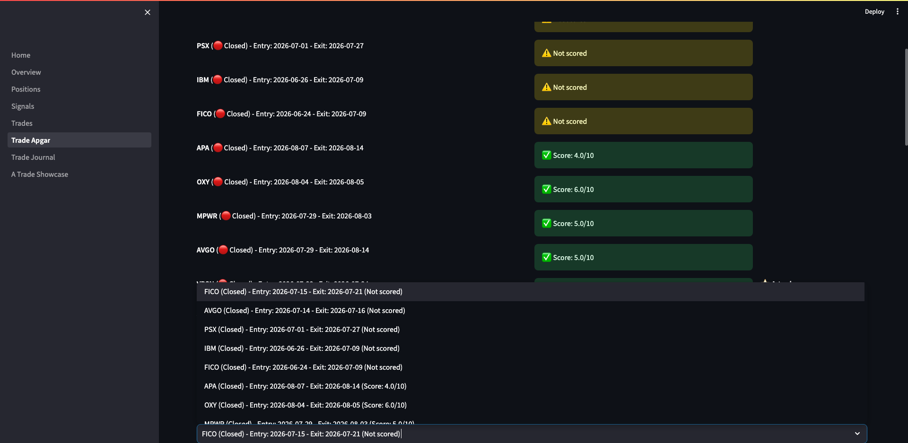

# Trade Journaling & Post-Trade Analysis Guide

**Version:** 1.0 | **Last Updated:** 2026-09-08 | **Audience:** Triple Screen Traders

---

## Overview

The Trade Apgar and Trade Journal pages help you systematically evaluate and learn from every trade. Trade Apgar scores setup quality immediately after entry, while Trade Journal documents exit decisions and retrospective analysis 2+ months later.

**Use this guide to:**
- Score trade quality using the 5-criteria Apgar system
- Document exit reasons, tactics, and market context
- Conduct hindsight reviews to improve future performance
- Identify which setups consistently produce A-trades

**Van K. Tharp's Philosophy:** Post-trade analysis is where real learning happens. Winners teach you to maximize profits; losers teach you to avoid poor setups.

---

## Trade Apgar vs Trade Journal

| Aspect | Trade Apgar | Trade Journal |
|--------|-------------|---------------|
| **When** | Immediately after entry (within 1 week) | After exit + 60 days later |
| **Purpose** | Score setup quality while fresh | Document exit tactics and learn from hindsight |
| **Outcome** | Identify A-trades (score 7+) | Improve exit discipline and pattern recognition |

**Workflow:** Apgar first (score the entry), Journal second (analyze the exit), Review third (learn with hindsight).

---

## Step-by-Step Instructions

### Task 1: Score Trade Quality with Apgar

**Purpose:** Systematically evaluate whether your entry met quality standards. A-trades (score 7+) should outperform lower-quality setups.

**When to Complete:** Within 1 week of position entry, while setup details are fresh in your memory.

**Steps:**

1. Navigate to **Trade Apgar** page in dashboard sidebar

   **Look for:** List of open and closed positions, sorted with unscored trades first

2. Use status filter to select positions:

   

   - **Open**: Score current positions
   - **Closed**: Retrospectively score completed trades
   - **All**: See all positions needing Apgar

3. Select position to score from dropdown menu

   Display shows: Symbol, entry/exit dates, stop loss, shares, initial risk

   The **Moving Average Envelope** percentage displays at top (use this to verify your chart settings)

4. Score each of 5 criteria (0, 1, or 2 points):

   

   **Criterion 1: Daily Price**
   - 0 points: Above value zone
   - 1 point: In the value zone
   - 2 points: Below the value zone

   **Criterion 2: MACD Uptick**
   - 0 points: Shallow above centre line
   - 1 point: Shallow below centre line
   - 2 points: Deep below centre line

   **Criterion 3: Weekly Impulse**
   - 0 points: Red
   - 1 point: Green
   - 2 points: Blue (after red)

   **Criterion 4: RSI**
   - 0 points: Overbought (>70)
   - 1 point: Neutral (30-70)
   - 2 points: Oversold (<30)
   - **Enter exact RSI value** in number field below scoring radio buttons

   **Criterion 5: Perfection**
   - 0 points: Neither timeframe perfect
   - 1 point: One timeframe perfect
   - 2 points: Both timeframes perfect

5. Review total score and A-trade status

   **Total Score:** Displays automatic sum of 5 criteria (0-10)

   **A-trade Threshold:** Score 7 qualifies as A-trade

   **Target:** Aim for 30-40% of trades to be A-trades (if higher, you might be too selective; if lower, you might be taking poor setups)

6. Document market context:

   **Earnings Date:** Check Briefing.com or company investor relations calendar

   **Dividend Date (Ex-Div):** Check Yahoo Finance or company IR calendar

   **Market Conditions:** Describe broader market and sector context
   - Example: "Spike bounce in effect, S&P above 50MA, sector showing relative strength vs market"

7. Write entry rationale:

   **Entry Reason (Required):** Explain why you took this trade
   - Example: "Perfect pullback to EMA-26, strong Force Index divergence, early breakout with volume confirmation"

   **Be specific:** Reference exact technical signals you saw

8. Upload entry charts:

   **Daily Chart:** Shows entry trigger on daily timeframe

   **Weekly Chart:** Shows weekly trend context

   **File requirements:** JPG or PNG, maximum 2MB per file

   **Chart setup:** Use the Moving Average Envelope percentage displayed at top to match system settings

9. Save Apgar scoring:

   Click **Save Apgar & Context** button

   **Result:** Position marked with Apgar score, charts uploaded, ready for exit analysis

**Result:** Trade documented with quality score, market context, and visual reference for future review.

---

### Task 2: Document Exit Decisions in Trade Journal

**Purpose:** Record why you exited and which tactic you used. This creates a database of exit patterns you can analyze for improvement.

**When to Complete:** Immediately after closing position (while exit decision is fresh).

**Steps:**

1. Navigate to **Trade Journal** page in dashboard sidebar

   **Look for:** List of closed positions with journal completion status

2. Use filters to find trades needing documentation:

   **Exit Details:** Filter by documented/pending exit descriptions

   **Post-Trade Review:** Filter by review completion status

   **A-Trades Only:** Show only highest-quality setups (Apgar score 7+)

3. Select closed position from dropdown menu

   Display shows: Symbol, exit date, P&L, R-multiple

4. Review **Section A: Reason for Entry**

   Shows entry rationale from Trade Apgar (read-only reference)

   View entry charts by clicking thumbnail images

5. Review **Section B: Entry/Exit Documentation**

   Auto-populated data:
   - Entry date, price, shares, total cost, commission
   - Exit date, price, total value
   - Gain/Loss percentage, Gain/Loss pounds, R-multiple, days held
   - Partial exits (if applicable)

6. Complete **Section C: Reason for Exit**

   **If not yet documented:**

   Write detailed exit description in text area:
   - Example: "Hit R1 target, showing signs of reversal in morning session. MACD histogram weakening, Force Index turning negative."

   Upload exit chart(s) showing entry + exit together

   Click **Save Exit Details** button

   **If already documented:**

   Review existing exit description and charts

   Click **Add Exit Chart** to upload additional context if needed

7. Complete **Section D: Exit Tactic**

   **If not yet selected:**

   Choose from Elder's exit tactic list:
   - **2:1 Hit target** - Reached profit target (R1, R2, or R3)
   - **2:2 Hit stop** - Stop loss triggered (initial or trailing)
   - **2:3 Hit value zone** - Reached value zone on weekly chart
   - **2:3a Hit envelope** - Hit upper channel envelope
   - **2:4 Trade going nowhere** - Trade stalled, no progress toward targets
   - **2:5 Started turning** - Price action reversing against position
   - **2:6 Couldn't stand the pain** - Emotional exit due to market stress
   - **2:7 Junk trade** - Recognized setup was flawed

   Click **Save Exit Tactic** button

   **If already saved:**

   Review selected tactic (displayed with description)

8. Complete **Section E: Post-Trade Analysis** (only after 60+ days)

   **Not yet eligible:**

   Page displays: "Review eligible in X days (60 days after exit)"

   **Eligible for review:**

   Write retrospective analysis with 2+ months of hindsight:
   - Example: "In hindsight, this was a great entry. Could have held for R3 target instead of exiting early at R1. Weekly uptrend continued for 6 more weeks after my exit."

   Upload follow-up chart(s) showing how trade developed after exit

   Click **Save Post-Trade Review** button

   **Review complete:**

   Page displays review text, timestamp, and follow-up charts

**Result:** Complete exit documentation with tactical classification and hindsight analysis.

---

### Task 3: View Individual Trade Details

**Purpose:** Analyze complete trade lifecycle from entry to exit to retrospective review.

**Steps:**

1. Navigate to **Trade Journal** page

2. Select position from dropdown menu

3. Review all 5 sections in sequence:

   **Section A:** Why you entered (from Apgar)

   **Section B:** Entry/exit numbers (auto-populated)

   **Section C:** Why you exited (your description + charts)

   **Section D:** Exit tactic classification

   **Section E:** What you learned 2+ months later

4. Click chart thumbnails to view full-size images

   Click **Back to Thumbnail** to return to overview

5. Delete unwanted charts with trash icon if needed

**Result:** Complete trade story from initial setup through final retrospective.

---

### Task 4: Review Journal History and Learn from Patterns

**Purpose:** Identify which setups and exit tactics correlate with best/worst performance.

**Steps:**

1. Use **Trade Journal** filters to analyze patterns:

   **A-Trades Only:** Compare A-trade exits vs lower-quality setups
   - Do A-trades reach higher R-multiples?
   - Which exit tactics dominate A-trades?

   **Exit Tactic Analysis:** Filter by specific tactic (e.g., "Hit target")
   - Which tactics produce best R-multiples?
   - Are you exiting winners too early ("Hit target" vs "Started turning")?

   **Post-Trade Review Complete:** Read hindsight analyses
   - What patterns emerge in "could have held longer"?
   - Which setups looked better/worse with hindsight?

2. Track journal completion metrics:

   Dashboard displays:
   - Total closed positions
   - Exit documented count (target: 100%)
   - Eligible for review count (60+ days since exit)
   - Reviews complete count (target: 80%+)

3. Identify improvement opportunities:

   **If many exits are "Couldn't stand the pain":** Work on emotional discipline

   **If many exits are "Trade going nowhere":** Tighten entry criteria for momentum

   **If hindsight reviews show "exited too early":** Consider wider targets or trailing stops

**Result:** Pattern recognition that improves future entry and exit decisions.

---

## Tips & Best Practices

**Apgar Scoring:**

- Complete Apgar within 1 week of entry while setup details are fresh
- Be honest in scoring (this is for learning, not ego stroking)
- Aim for 30-40% A-trade rate (too high = overselective, too low = taking poor setups)
- Always upload entry charts (you'll forget details in 6 months)
- Enter exact RSI value for criterion 4 (enables precise analysis later)

**Exit Documentation:**

- Document exits same day you close position (memory fades quickly)
- Upload exit chart showing full trade lifecycle (entry + exit together)
- Be specific in exit reason (reference exact technical signals)
- Choose exit tactic honestly (even if it was "Couldn't stand the pain")

**Post-Trade Review:**

- Wait full 60 days before hindsight review (prevents recency bias)
- Upload follow-up chart showing what happened after your exit
- Focus on learning, not regret ("What would I do differently next time?")
- Review A-trades and non-A-trades equally (both teach important lessons)

**Chart Management:**

- Keep file sizes under 2MB (use JPG format with moderate compression)
- Set chart envelope to match system percentage before screenshots
- Use weekly + daily charts together for complete context
- Delete duplicate or poor-quality charts to keep journal clean

**Common Mistakes:**

- Skipping Apgar scoring (you lose quality tracking data)
- Not documenting exits immediately (you forget critical details)
- Rushing post-trade review before 60 days (recency bias distorts learning)
- Uploading charts without proper timeframe context
- Being dishonest about exit tactics ("Hit target" when actually "Couldn't stand the pain")

---

## Troubleshooting

**Problem:** Chart upload fails with "Chart storage service not available"

**Solution:** Check that chart_storage service is running. Contact system administrator if issue persists.

**Problem:** Cannot select position to score (dropdown empty)

**Solution:** Verify you have open or closed positions in database. Check status filter - change from "Open" to "All" if no open positions exist.

**Problem:** Post-trade review section shows "Review eligible in X days" but I want to review now

**Solution:** System enforces 60-day waiting period to prevent recency bias. You cannot override this - it's a discipline mechanism. Use the time to work on other trades.

**Problem:** Apgar criteria don't match my strategy

**Solution:** Edit `/backend/config/trade_apgar_config.yaml` to customize criterion labels and descriptions. Requires system restart to take effect.

**Problem:** Uploaded chart appears corrupted or blank

**Solution:**
- Check file format is JPG or PNG (no GIF, BMP, or other formats)
- Verify file size under 2MB
- Try re-exporting chart with different compression settings
- Delete corrupted chart and re-upload

**Problem:** Cannot find specific trade in journal

**Solution:** Use filters: Check "Exit Details: All" and "Post-Trade Review: All" to show all closed positions. If still missing, verify position status is "closed" in database.

---

## FAQ

**Q: Do I need to complete Apgar scoring for every trade?**

A: Target 80%+ completion. Focus on trades you plan to analyze later. Skipping a few rushed entries is acceptable, but consistent Apgar scoring builds valuable quality data over time.

**Q: What if I scored a trade incorrectly and want to update the Apgar?**

A: Select the position again in Trade Apgar page, adjust scores, and click Save. The system updates existing scores (doesn't create duplicates).

**Q: Can I delete or edit journal entries after saving?**

A: You can update exit details and post-trade reviews by selecting the position and editing text. Previous versions are not tracked - latest save overwrites.

**Q: How do I analyze which exit tactics produce best results?**

A: Export closed positions from database and group by `exit_reason` field (contains tactic code). Compare average R-multiples across tactic categories. This requires SQL query or spreadsheet export.

**Q: Should I complete post-trade reviews for losing trades?**

A: Yes - losers teach the most valuable lessons. Review what you missed at entry, whether you exited at correct time, and how you could have avoided the loss.

**Q: What's the point of waiting 60 days for post-trade review?**

A: Van K. Tharp's research shows traders have severe recency bias immediately after exits. Waiting 2+ months allows emotional distance and clearer pattern recognition.

**Q: Can I upload charts after initial save?**

A: Yes. Both Trade Apgar and Trade Journal allow adding charts later. Existing charts display with delete option; use upload forms to add new ones.

**Q: What if earnings/dividend dates are unknown at entry?**

A: Leave fields blank initially. Update Trade Apgar later when dates become available (check Briefing.com or company IR calendar).

---

## Related Guides

**Next Steps:**
- **GUIDE-002: Signal Management** - Managing pre-entry watchlist and pending signals
- **GUIDE-003: Trade Execution** - Entering and managing live positions

**Prerequisites:**
- **GUIDE-001: Dashboard Navigation** - Understanding dashboard page structure

**Advanced:**
- **Trade Analysis Reports** (future guide) - Exporting and analyzing journal data

---

## Glossary

| Term | Definition |
|------|------------|
| **Trade Apgar** | 5-criteria scoring system (0-10 points) evaluating setup quality after entry |
| **A-trade** | High-quality trade scoring 7+ on Apgar scale |
| **Exit Tactic** | Elder's classification system for why you exited (8 standard categories) |
| **Post-Trade Review** | Retrospective analysis completed 60+ days after exit with hindsight |
| **R-multiple** | Profit/loss measured in units of initial risk (1R = risk amount) |
| **Value Zone** | Price range below weekly EMA-13 where entries have statistical edge |
| **Force Index** | Elder's momentum indicator combining price change and volume |
| **Impulse System** | Elder's trend filter based on EMA and MACD histogram (red/blue/green) |

---

## Change Log

| Date | Version | Author | Changes |
|------|---------|--------|---------|
| 2026-09-08 | 1.0 | IB | Initial creation |
