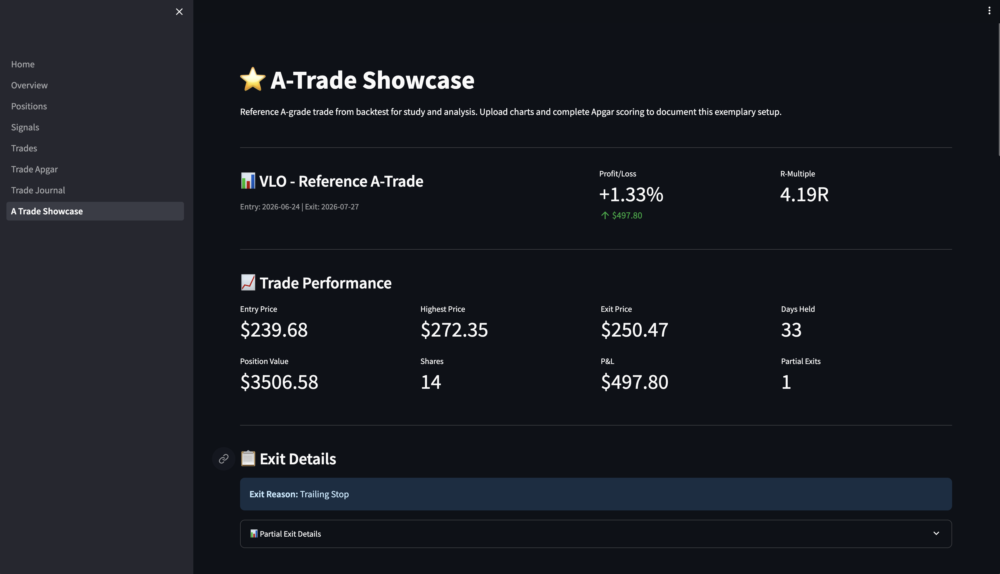
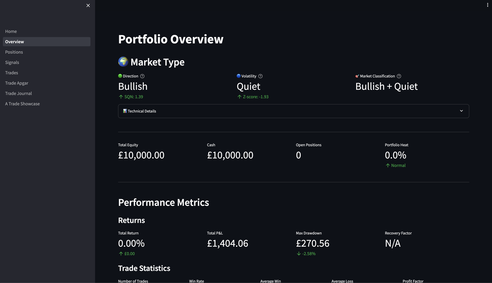

# Understanding Your Trading Performance

**Version:** 1.0 | **Last Updated:** 2026-09-08 | **Audience:** All users

---

## Overview

The Overview page in your dashboard shows how well your trading system is performing. It displays your account growth, win rate, and risk levels in easy-to-read charts and numbers.

**Use this guide to:**
- Understand what each metric means in plain English
- Interpret the market classification indicators
- Read your equity curve to track account growth
- Know when your risk levels are healthy vs. concerning

---

## What the Numbers Mean

### Market Classification

**What it shows:** Whether the overall market (S&P 500) is going up, down, or sideways, and how volatile it is.

**Why it matters:** Your trading strategy performs differently in different market conditions. A bullish market may produce more signals than a bearish one.

#### Direction Indicator

This tells you the market trend:

- **Super Bullish** (Green): Strong upward trend
- **Bullish** (Green): Moderate upward trend
- **Sideways** (Yellow): No clear direction
- **Bearish** (Red): Moderate downward trend
- **Super Bearish** (Red): Strong downward trend

**How we calculate it:** We look at the S&P 500's daily price changes over the last 100 trading days and calculate something called the "System Quality Number" or SQN. Think of it like a report card score for market direction.

- SQN of 1.5 or higher = Super Bullish
- SQN between 0.75 and 1.5 = Bullish
- SQN between -0.75 and 0.75 = Sideways
- SQN between -0.45 and -0.75 = Bearish
- SQN below -0.45 = Super Bearish

#### Volatility Indicator

This tells you how choppy the market is:

- **Super Volatile** (Red): Extreme price swings
- **Volatile** (Orange): Above-average price swings
- **Normal** (Green): Typical price movement
- **Quiet** (Blue): Below-average price movement

**How we calculate it:** We measure how much the market's daily price range (called Average True Range or ATR) differs from its normal range over the past 13 weeks. We express this as a "Z-score" - a statistical measure of how unusual the current volatility is.

- Z-score above 3.0 = Super Volatile (very unusual)
- Z-score between 0.5 and 3.0 = Volatile
- Z-score between -0.5 and 0.5 = Normal
- Z-score below -0.5 = Quiet

**Example:** If the market classification shows "Bullish + Normal", it means stocks are trending upward with typical price swings - good conditions for most trading strategies.

---

### Portfolio Summary

These four numbers at the top give you a snapshot of your account:

#### Total Equity

**What it is:** The total value of your account (cash plus the value of any open positions).

**Example:** If you started with £10,000 and made £500 in profits, your total equity is £10,500.

#### Cash

**What it is:** Money sitting in your account not currently invested.

**Why it matters:** You need cash available to take new trades. If all your money is in open positions, you can't enter new opportunities.

#### Open Positions

**What it is:** How many stocks you currently own.

**Example:** If you own shares in 3 different companies, you have 3 open positions.

#### Portfolio Heat

**What it is:** The percentage of your account at risk across all open positions.

**How we calculate it:** For each open position, we calculate how much you would lose if the stock hit your stop-loss. We add these up and divide by your total equity.

**Example:** You have £10,000 total equity. You own 3 stocks, and if all three hit their stop-losses, you'd lose £100, £120, and £80 (total £300). Your portfolio heat is 3%.

**What's healthy:**
- Below 6% = Normal (green)
- Above 6% = High (yellow/red)

If your heat is above 6%, you're risking too much of your account at once. Consider reducing position sizes.

---

### Performance Metrics

#### Total Return

**What it is:** How much money you've made or lost since you started trading.

**Displayed two ways:**
- **Percentage:** How much you've grown relative to starting capital
- **Pound amount:** Actual profit or loss in money

**Example:** Started with £10,000, now at £10,800.
- Total Return = +8% (percentage)
- Total Return = +£800 (amount)

#### Total P&L (Profit & Loss)

**What it is:** Same as Total Return (amount), but only from closed trades. This doesn't include unrealized gains/losses from open positions.

**Example:** You've closed 10 trades. 7 made money (total +£1,200), 3 lost money (total -£400). Your Total P&L is £800.

#### Max Drawdown

**What it is:** The largest drop in your account value from a peak to a valley.

**Displayed two ways:**
- **Percentage:** Drop as % of your peak equity
- **Pound amount:** Actual money lost from peak to bottom

**Example:** Your account grew from £10,000 to £12,000, then dropped to £11,000. Your max drawdown is:
- -£1,000 (amount)
- -8.3% (percentage: £1,000 ÷ £12,000)

**Why it matters:** Shows the worst losing streak you've experienced. Lower is better. If you know your max drawdown is 6%, you know to expect occasional 6% dips and won't panic.

#### Recovery Factor

**What it is:** How many times larger your total profit is compared to your worst drawdown.

**Formula:** Total Return ÷ Max Drawdown

**Example:** Made £800 total, worst drawdown was £400. Recovery factor = 2.0

**What's good:**
- Above 3.0 = Excellent (you recover quickly from losses)
- 1.5 to 3.0 = Good
- Below 1.5 = Needs improvement

---

### Trade Statistics

#### Number of Trades

**What it is:** How many positions you've closed since you started tracking.

**Why it matters:** You need a reasonable sample size (at least 30-50 trades) before the other statistics become meaningful.

#### Win Rate

**What it is:** What percentage of your trades make money.

**Example:** 10 closed trades: 6 winners, 4 losers = 60% win rate.

**Important:** A high win rate doesn't guarantee profitability. You can have a 30% win rate and still make money if your winners are much larger than your losers.

#### Average Win

**What it is:** The average profit from your winning trades.

**Example:** 6 winning trades: +£200, +£150, +£300, +£100, +£250, +£180. Average win = £196.67

#### Average Loss

**What it is:** The average loss from your losing trades (shown as a positive number).

**Example:** 4 losing trades: -£80, -£120, -£90, -£110. Average loss = £100

#### Profit Factor

**What it is:** How much you make on winners compared to what you lose on losers.

**Formula:** Total profits from all winners ÷ Total losses from all losers

**Example:**
- All winners total: £1,200
- All losers total: £400
- Profit Factor = 3.0

**What's good:**
- Above 2.0 = Excellent
- 1.5 to 2.0 = Good
- 1.0 to 1.5 = Break-even to modest profit
- Below 1.0 = Losing money

A profit factor of 2.0 means you make £2 for every £1 you lose.

---

### Advanced Metrics

#### Expectancy

**What it is:** How much you expect to make, on average, per trade. This is the most important metric for long-term success.

**Formula:** (Win Rate × Average Win) - (Loss Rate × Average Loss)

**Example:**
- Win rate: 60% (Loss rate: 40%)
- Average win: £197
- Average loss: £100
- Expectancy = (0.60 × £197) - (0.40 × £100) = £78.20

This means every time you take a trade, you can expect to make about £78 on average over many trades.

**What's good:**
- Positive = Making money over time
- Above £50 = Good for a £10k account
- Above £100 = Excellent
- Negative = Losing money (stop trading and fix strategy)

**Why it matters:** Even if you have losing streaks, as long as expectancy is positive, you'll be profitable over many trades.

#### Sharpe Ratio

**What it is:** A measure of how much return you get for the risk you take. Higher is better.

**How we calculate it:** We look at how consistent your returns are. If you make 20% annually but have huge swings, your Sharpe ratio is lower than someone making 15% with steady growth.

**What's good:**
- Above 1.5 = Excellent (very smooth equity curve)
- 1.0 to 1.5 = Good
- 0.5 to 1.0 = Acceptable
- Below 0.5 = Too volatile

**Example:** Two traders both made 20% this year:
- Trader A: Steady growth each month (Sharpe = 1.8)
- Trader B: Lost money 6 months, big wins 6 months (Sharpe = 0.4)

Trader A has a better Sharpe ratio because returns were more consistent.

---

### Equity Curve

**What it is:** A chart showing your account value over time.

**How to read it:**
- **Blue line:** Your actual account value
- **Red dashed line:** Your starting capital (£10,000)
- **X-axis (horizontal):** Time
- **Y-axis (vertical):** Account value in pounds

**What to look for:**

1. **Upward slope:** You're making money
2. **Flat periods:** Break-even stretches (normal)
3. **Dips:** Losing streaks (also normal)
4. **Overall trend:** Should be up and to the right over many months

**Example interpretation:**

If your chart shows:
- Started at £10,000
- Small dip to £9,800 in month 1
- Climbed to £10,500 by month 3
- Now at £11,200 after 6 months

**What this tells you:** You had an early rough patch (normal), recovered, and are now up 12%. The overall trend is positive.

**Warning signs:**
- Long downward slope (not just a dip)
- Multiple sharp drops
- Not recovering to previous peaks

If you see these, review your trades and consider if your strategy needs adjustment.

---

## Tips & Best Practices

💡 **Tip:** Check your metrics weekly, not daily. Day-to-day swings are normal noise - focus on the trend over weeks and months.

💡 **Tip:** A good trading system typically has:
- Win rate: 40-60%
- Profit factor: 1.5 or higher
- Positive expectancy
- Max drawdown under 20%

💡 **Tip:** Portfolio heat above 6% means you're taking too much risk. Reduce position sizes until heat drops below 6%.

 **Common Mistake:** Focusing only on win rate. A 70% win rate is useless if your winners are tiny and losers are huge. Always look at profit factor and expectancy together.

 **Common Mistake:** Panicking during normal drawdowns. If your max drawdown is 8%, expect to see 5-8% dips periodically. That's normal system behavior.

---

## Troubleshooting

**Problem:** My equity curve is jagged with big swings
**Solution:** This is normal early on. As you accumulate more trades (50+), the curve should smooth out. If volatility continues, consider:
- Reducing position sizes
- Tightening stop-losses
- Being more selective with entries

**Problem:** Win rate is high but I'm losing money
**Solution:** Your average loss is larger than your average win. Check your stops - you may be letting losers run too long or cutting winners too early.

**Problem:** Expectancy is negative
**Solution:** Stop trading immediately. Review your last 20 trades to identify the problem:
- Are you entering too early/late?
- Are stops too tight or too wide?
- Are you following your rules consistently?

**Problem:** Portfolio heat shows "High" constantly
**Solution:** You're sizing positions too large. Reduce share quantities until heat drops below 6%. Better to take smaller positions and stay in the game than risk blowing up your account.

---

## FAQ

**Q: How many trades do I need before these metrics are meaningful?**

A: At least 30 closed trades, ideally 50-100. With fewer trades, metrics can swing wildly based on a few good or bad trades.

**Q: What's more important: win rate or profit factor?**

A: Profit factor. You can have a 35% win rate and be very profitable if winners are 3-4x larger than losers. Conversely, a 65% win rate with tiny winners and big losers will lose money.

**Q: How often should I check my performance metrics?**

A: Weekly is ideal. Daily checking can cause emotional reactions to normal variance. Monthly works too if you're patient.

**Q: What if my max drawdown is larger than I'm comfortable with?**

A: Reduce position sizes. If a 6% drawdown makes you nervous, size positions to limit heat to 3-4% instead of the maximum 6%.

**Q: Should I keep trading during a drawdown?**

A: If your expectancy is positive and you're following your rules, yes. Drawdowns are normal. However, if you've broken rules or see fundamental strategy problems, pause and review.

---

## Related Guides

**Next Steps:**
- GUIDE-002: Managing Your Weekly Watchlist (understand where signals come from)
- GUIDE-004: Setting Up Price Alerts (get notified of trade opportunities)

**Prerequisites:**
- GUIDE-001: Dashboard Navigation Basics (learn how to access the Overview page)

---

## Glossary

| Term | Definition |
|------|------------|
| **Equity** | Total value of your account (cash + value of open positions) |
| **Position** | A stock you own or a trade you've entered |
| **Stop-loss** | A price level where you exit to limit your loss |
| **Portfolio Heat** | Percentage of your account at risk across all open positions |
| **Drawdown** | A decline in your account value from a peak |
| **Expectancy** | Average profit per trade over many trades |
| **Win Rate** | Percentage of trades that make money |
| **Profit Factor** | Total profits divided by total losses |
| **Sharpe Ratio** | Measure of return consistency (reward per unit of risk) |
| **Recovery Factor** | How quickly you recover from losses (profit ÷ max drawdown) |
| **SQN (System Quality Number)** | Statistical measure of market trend strength |
| **ATR (Average True Range)** | Measure of price volatility |
| **Z-score** | Statistical measure of how unusual a value is |
| **R-multiple** | Profit or loss measured in units of risk (used in Van K. Tharp methodology) |

---

## Change Log

| Date | Version | Author | Changes |
|------|---------|--------|---------|
| 2026-09-08 | 1.0 | IB | Initial creation |
