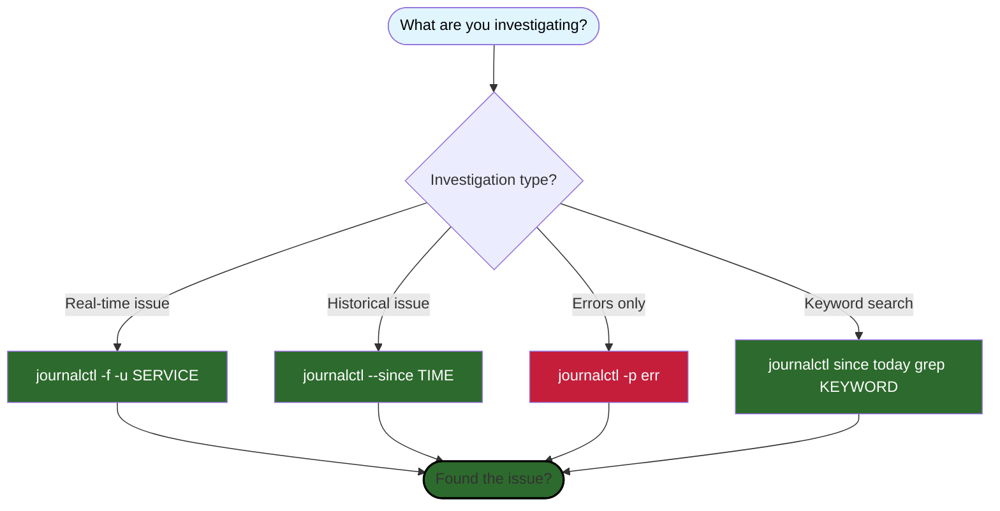

# SOP-002: Log Monitoring and Analysis

**Version:** 1.0 | **Owner:** Operations Team | **Review Date:** 2026-12-08

---

## Purpose

This procedure provides systematic methods for viewing, filtering, and analyzing Triple Screen system logs to monitor service health, diagnose issues, and investigate incidents. Effective log monitoring enables rapid issue detection, root cause analysis, and performance optimization.

---

## Scope

**When to use this SOP:**
- Daily health monitoring of Triple Screen services
- Investigating errors or unexpected behavior
- Debugging live trading issues during market hours
- Performance analysis and optimization
- Incident investigation and post-mortem analysis

**When NOT to use:**
- Emergency trading stops (see SOP-001: VPS Service Management)
- Database queries for trading data (see SOP-003: Database Access)

---

## Prerequisites

Before starting, ensure you have:
-  SSH access to VPS (`ssh triple-screen@vps.example.com`)
-  Basic understanding of systemd and journalctl
-  Knowledge of Triple Screen service architecture
-  Understanding of time zones (all logs in VPS timezone)

**Available Triple Screen Services:**
- `triple-screen-orchestrator` - Live trading execution
- `triple-screen-dashboard` - Web dashboard
- `triple-screen-daily-data` - Daily data refresh
- `triple-screen-data-verify` - Data validation
- `ibgateway` - Interactive Brokers Gateway

---

## Log Analysis Workflow

Use this simple decision tree to quickly find the right journalctl command:



---

## Procedure

### Step 1: View Real-Time Logs (Follow Mode)

Monitor live log output as services run, ideal for watching trades execute or diagnosing active issues.

```bash
# Follow single service logs
journalctl -u triple-screen-orchestrator -f

# Follow multiple services simultaneously
journalctl -u triple-screen-orchestrator -u triple-screen-dashboard -f
```

**Expected output:**
```
Sep 08 09:30:15 vps orchestrator[1234]: Market open - starting scan
Sep 08 09:30:16 vps orchestrator[1234]: Processing 507 symbols
Sep 08 09:30:17 vps orchestrator[1234]: Found 3 new signals
```

**Stop following:** Press `Ctrl+C`

**Success criteria:**
- Logs stream continuously with timestamps
- Service activity visible in real-time
- No recurring error messages

---

### Step 2: Filter Logs by Time Range

Search logs for specific time periods to investigate incidents or analyze patterns.

**Basic Time Filtering:**
```bash
# Last N minutes/hours
journalctl -u triple-screen-orchestrator --since "10 min ago"
journalctl -u triple-screen-orchestrator --since "1 hour ago"

# Relative time references
journalctl -u triple-screen-orchestrator --since "yesterday"
journalctl -u triple-screen-orchestrator --since "today"

# Specific date/time
journalctl -u triple-screen-orchestrator --since "2026-09-08"
journalctl -u triple-screen-orchestrator --since "2026-09-08 09:30:00"
```

**Time Range Filtering:**
```bash
# Between two times (market hours example)
journalctl -u triple-screen-orchestrator \
  --since "2026-09-08 09:30:00" \
  --until "2026-09-08 16:00:00"

# Yesterday's full trading day
journalctl -u triple-screen-orchestrator \
  --since "yesterday 09:00" \
  --until "yesterday 17:00"
```

**Common Use Cases:**
```bash
# Morning pre-market (data refresh)
journalctl -u triple-screen-daily-data --since "today 07:00" --until "today 09:00"

# Market open activity (first 30 minutes)
journalctl -u triple-screen-orchestrator --since "today 09:30" --until "today 10:00"

# After-hours investigation
journalctl -u triple-screen-orchestrator --since "today 16:00"
```

**Success criteria:**
- Logs limited to specified time range
- Timestamps match requested period
- Relevant activity visible for time period

---

### Step 3: Filter for Errors Only

Quickly identify issues by filtering logs to show only errors and critical messages.

**Error Priority Filtering:**
```bash
# Errors only (priority 3)
journalctl -u triple-screen-orchestrator -p err

# Errors and warnings (priority 3-4)
journalctl -u triple-screen-orchestrator -p warning

# Critical errors only (priority 0-2)
journalctl -u triple-screen-orchestrator -p crit
```

**Combine with Time Filter:**
```bash
# Errors from last hour
journalctl -u triple-screen-orchestrator -p err --since "1 hour ago"

# Today's errors across all services
journalctl -u "triple-screen-*" -p err --since "today"
```

**Expected output (healthy system):**
```
-- No entries --
```

**Expected output (errors present):**
```
Sep 08 09:35:12 vps orchestrator[1234]: ERROR: Market data connection lost
Sep 08 09:35:13 vps orchestrator[1234]: ERROR: Failed to fetch quote for AAPL
```

**Success criteria:**
- Only error/warning messages displayed
- Able to identify specific failure points
- Error timestamps correlate with reported issues

---

### Step 4: Search Logs for Keywords

Find specific events, symbols, or operations within logs using grep patterns.

**Symbol-Specific Searches:**
```bash
# All logs mentioning AAPL
journalctl -u triple-screen-orchestrator --since "today" | grep AAPL

# Case-insensitive search
journalctl -u triple-screen-orchestrator --since "today" | grep -i "connection"

# Multiple patterns
journalctl -u triple-screen-orchestrator --since "today" | grep -E "AAPL|TSLA|MSFT"
```

**Operation-Specific Searches:**
```bash
# Signal generation events
journalctl -u triple-screen-orchestrator --since "today" | grep "new signal"

# Order execution events
journalctl -u triple-screen-orchestrator --since "today" | grep -i "order"

# Database operations
journalctl -u triple-screen-api --since "1 hour ago" | grep -i "database"

# Dashboard events
journalctl -u triple-screen-dashboard --since "today" | grep -i "streamlit"
```

**Context Lines (Show Surrounding Logs):**
```bash
# Show 5 lines before/after matches
journalctl -u triple-screen-orchestrator --since "today" | grep -A 5 -B 5 "ERROR"
```

**Expected output:**
```
Sep 08 09:30:15 vps orchestrator[1234]: Processing symbol AAPL
Sep 08 09:30:16 vps orchestrator[1234]: Weekly EMA crossed on AAPL
Sep 08 09:30:17 vps orchestrator[1234]: Generated new signal for AAPL
```

**Success criteria:**
- Relevant log entries found
- Context visible around matches
- Pattern matches expected behavior

---

### Step 5: Export Logs for Analysis

Save logs to files for detailed analysis, sharing with support, or archival.

**Export to File:**
```bash
# Today's orchestrator logs
journalctl -u triple-screen-orchestrator --since "today" > ~/logs/orchestrator-$(date +%Y%m%d).log

# Error logs only
journalctl -u triple-screen-orchestrator -p err --since "today" > ~/logs/errors-$(date +%Y%m%d).log

# Multiple services combined
journalctl -u triple-screen-orchestrator -u triple-screen-dashboard --since "today" > ~/logs/combined-$(date +%Y%m%d).log

# Specific time range (incident investigation)
journalctl -u triple-screen-orchestrator \
  --since "2026-09-08 09:30:00" \
  --until "2026-09-08 10:00:00" \
  > ~/logs/incident-morning-crash.log
```

**Access File-Based Logs:**
```bash
# View orchestrator file logs
tail -n 100 /var/log/triple-screen/orchestrator.log

# Follow file logs in real-time
tail -f /var/log/triple-screen/orchestrator.log

# View error stream separately
tail -f /var/log/triple-screen/orchestrator-error.log

# Search within file logs
grep "AAPL" /var/log/triple-screen/orchestrator.log
```

**Download to Local Machine:**
```bash
# From local terminal (not VPS)
scp triple-screen@vps.example.com:~/logs/orchestrator-20260908.log ~/Desktop/
```

**Success criteria:**
- File created with expected content
- File size reasonable (not truncated)
- Logs readable and properly formatted
- File accessible for analysis tools

---

### Step 6: Monitor Multiple Services Simultaneously

Track all Triple Screen services to get holistic system view.

**View All Services:**
```bash
# All Triple Screen service logs
journalctl -u "triple-screen-*" -f

# All services with errors only
journalctl -u "triple-screen-*" -p err --since "1 hour ago"

# All services for specific time range
journalctl -u "triple-screen-*" --since "today 09:30" --until "today 10:00"
```

**Service Status Overview:**
```bash
# List all Triple Screen services
systemctl list-units "triple-screen-*"

# Check for failed services
systemctl list-units "triple-screen-*" --state=failed

# Status of specific services
systemctl status triple-screen-orchestrator triple-screen-dashboard
```

**Combined Monitoring Script:**
```bash
# Create quick monitoring script
cat > ~/monitor-all.sh << 'EOF'
#!/bin/bash
echo "=== Service Status ==="
systemctl list-units "triple-screen-*" --no-pager

echo -e "\n=== Recent Errors (Last Hour) ==="
journalctl -u "triple-screen-*" -p err --since "1 hour ago" --no-pager

echo -e "\n=== Live Log Stream ==="
journalctl -u "triple-screen-*" -f
EOF

chmod +x ~/monitor-all.sh
~/monitor-all.sh
```

**Success criteria:**
- All services showing activity
- No services in failed state
- Logs correlate across services
- System-wide health visible at a glance

---

### Step 7: Manage Log Disk Space

Monitor and control log storage to prevent disk space issues.

**Check Log Disk Usage:**
```bash
# Total journalctl log size
journalctl --disk-usage

# Check log directory sizes
du -sh /var/log/triple-screen/
du -sh /opt/triple-screen/backend/logs/
```

**Expected output:**
```
Archived and active journals take up 512.0M in the file system.
```

**Rotate and Clean Logs:**
```bash
# Keep only last 7 days of logs
sudo journalctl --vacuum-time=7d

# Keep only 500MB of logs
sudo journalctl --vacuum-size=500M

# Remove old file logs (older than 30 days)
find /var/log/triple-screen/ -name "*.log.*" -mtime +30 -delete

# Verify space freed
df -h /var/log
```

**Configure Log Retention (Permanent):**
```bash
# Edit journald configuration
sudo nano /etc/systemd/journald.conf

# Add/modify these lines:
SystemMaxUse=500M
MaxRetentionSec=7d

# Restart journald
sudo systemctl restart systemd-journald
```

**Success criteria:**
- Disk usage reduced to acceptable levels
- Recent logs preserved
- Old logs archived or removed
- System partition has >20% free space

---

## Verification

After completing log monitoring procedures, verify by:

1. **Check log access works:**
   ```bash
   journalctl -u triple-screen-orchestrator -n 10
   ```
   Expected: 10 most recent log entries displayed

2. **Verify time filtering:**
   ```bash
   journalctl -u triple-screen-orchestrator --since "10 min ago" | head -5
   ```
   Expected: Logs from last 10 minutes only

3. **Test error filtering:**
   ```bash
   journalctl -u "triple-screen-*" -p err --since "today"
   ```
   Expected: No errors (healthy system) or specific errors listed

4. **Confirm disk space:**
   ```bash
   df -h / | tail -1
   ```
   Expected: Use% below 80%

**Expected results:**
-  Logs accessible via journalctl and file paths
-  Time filtering returns correct date ranges
-  Error filtering isolates issues
-  Disk space within acceptable limits
-  Export files readable and complete

---

## Troubleshooting

| Problem | Possible Cause | Solution |
|---------|---------------|----------|
| `journalctl: command not found` | Non-systemd system or missing package | Install systemd: `sudo apt install systemd` |
| No logs for service | Service name incorrect or not running | Verify service name: `systemctl list-units "triple-screen-*"` |
| Logs show "-- No entries --" | Service never started or logs cleared | Check service history: `systemctl status [service]` |
| Time filter returns no results | Time format incorrect or no logs for period | Use ISO format: `--since "2026-09-08 09:30:00"` |
| Permission denied on file logs | Insufficient file permissions | Use sudo: `sudo tail /var/log/triple-screen/*.log` |
| Disk space warning | Logs consuming too much space | Run vacuum: `sudo journalctl --vacuum-time=7d` |
| Cannot export logs | Directory doesn't exist | Create directory: `mkdir -p ~/logs` |
| Logs truncated in terminal | Output too large for screen buffer | Export to file or use less: `journalctl ... \| less` |

**Escalation:**
- If logs show critical errors → Stop trading immediately (see SOP-001), then investigate
- If disk space critically low (<10%) → Emergency cleanup: `sudo journalctl --vacuum-time=1d`
- If unable to access logs → Contact system administrator

---

## Common Use Cases

### Use Case 1: "Show me errors from the last hour"
```bash
journalctl -u "triple-screen-*" -p err --since "1 hour ago"
```

### Use Case 2: "What happened around 9:30 AM when trading started?"
```bash
journalctl -u triple-screen-orchestrator \
  --since "today 09:25" \
  --until "today 09:35"
```

### Use Case 3: "Find all logs mentioning symbol AAPL"
```bash
journalctl -u triple-screen-orchestrator --since "today" | grep AAPL
```

### Use Case 4: "Export logs from yesterday for debugging"
```bash
journalctl -u triple-screen-orchestrator \
  --since "yesterday 00:00" \
  --until "yesterday 23:59" \
  > ~/logs/orchestrator-yesterday.log
```

### Use Case 5: "Check if services are logging properly"
```bash
# Should show recent activity
journalctl -u "triple-screen-*" --since "5 min ago"
```

### Use Case 6: "Monitor live trading execution"
```bash
# Follow orchestrator during market hours
journalctl -u triple-screen-orchestrator -f | grep -E "signal|order|trade"
```

---

## Log Priority Levels

Understanding journalctl priority flags:

| Priority | Flag | Description | Example Use |
|----------|------|-------------|-------------|
| 0 - Emergency | `-p emerg` | System unusable | System crash |
| 1 - Alert | `-p alert` | Immediate action needed | Trading halt |
| 2 - Critical | `-p crit` | Critical conditions | Database down |
| 3 - Error | `-p err` | Error conditions | Failed API call |
| 4 - Warning | `-p warning` | Warning conditions | Slow response |
| 5 - Notice | `-p notice` | Normal but significant | Service start |
| 6 - Info | `-p info` | Informational | Trade executed |
| 7 - Debug | `-p debug` | Debug messages | Detailed trace |

**Default view:** Shows all priorities (0-7)
**Recommended for monitoring:** `-p warning` (shows warnings and above)
**Recommended for troubleshooting:** `-p err` (errors and above only)

---

## Related Documents

- **SOP-001:** VPS Service Management (service restart procedures)
- **SOP-003:** Database Access (trading data queries)
- **REF-001:** VPS Commands (quick reference card)
- **System Logs:** `/var/log/triple-screen/` directory structure

---

## Change Log

| Date | Version | Author | Changes |
|------|---------|--------|---------|
| 2026-09-08 | 1.0 | IB | Initial creation |

---

**Document Owner:** Ian Butler
**Next Review:** 2026-12-08
**Feedback:** Open GitHub issue or contact via project channels
