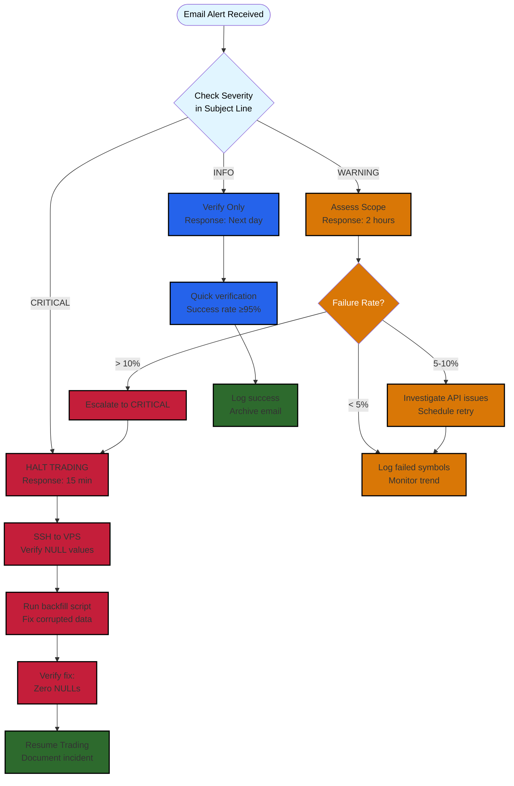

# SOP-004: Email Alert Response

**Version:** 1.0 | **Owner:** System Operator | **Review Date:** 2026-12-08

---

## Purpose

This SOP defines the systematic response procedure for email alerts sent by the Triple Screen trading system via SendGrid. Alerts are categorized by severity (CRITICAL, WARNING, INFO) and require different response times and actions. Following this procedure ensures data quality issues are detected and resolved before they impact trading decisions, prevents trading on corrupted data, and maintains system reliability.

Expected outcomes:
- Immediate detection and response to critical data quality issues
- Systematic investigation and resolution of data validation failures
- Verification of successful daily operations
- Prevention of trading on invalid or incomplete data

---

## Scope

**When to use this SOP:**
- Received email alert from Triple Screen system (subject contains [CRITICAL], [WARNING], or [INFO])
- Email monitoring during market data refresh windows (2:00-3:00 AM ET weekdays)
- Daily verification of successful data ingestion
- Investigating data quality issues affecting signal generation

**When NOT to use:**
- Manual data quality checks (use SOP-003 instead)
- Service health monitoring without alerts (use SOP-001)
- Trading execution issues (separate escalation procedure)

---

## Prerequisites

Before starting, ensure you have:
-  Access to email account receiving alerts (configured as ALERT_EMAIL_TO)
-  SSH access to VPS (for investigation steps)
-  Database credentials (for verification queries)
-  Understanding of alert severity levels and response times
-  Ability to execute database queries from SOP-003

---

## Alert Severity Levels

| Level | Response Time | Impact | Trading Allowed |
|-------|--------------|--------|-----------------|
| **CRITICAL** | Immediate (within 15 minutes) | System-wide data corruption, all signals invalid | ❌ HALT TRADING |
| **WARNING** | Within 2 hours | Partial data failure, some symbols affected |  Continue (monitor) |
| **INFO** | Verify only (next business day) | Normal operation confirmation |  Normal operations |

---

## Procedure

### Step 1: Identify Alert Severity from Email Subject

All Triple Screen alerts follow this format:
```
Subject: [SEVERITY] Triple Screen - [Alert Description]
```

## Alert Response Decision Tree

The following flowchart shows response times and actions based on alert severity:



**Decision tree summary:**
- **CRITICAL** (Red): 15-minute response → Halt trading → SSH verification → Run backfill → Resume after fix
- **WARNING** (Orange): 2-hour response → Assess failure rate → Retry or monitor → Escalate if >10% failure
- **INFO** (Blue): Next-day verification → Quick metrics review → Log success

**Success criteria:** Correctly identified severity level and corresponding response procedure

---

### Step 2: CRITICAL Alert Response - NaN Data Detected

 **CRITICAL**: DO NOT TRADE until this is resolved. All Force Index calculations will be INVALID.

#### Alert Example:
```
Subject: [CRITICAL] Triple Screen - NaN Data Detected - 235/507 symbols (46.4%)

Date: 2026-09-08
Severity: CRITICAL
Component: Daily Data Ingestion

Issue:
- 235/507 symbols (46.4%) have NaN values
- Affected date: 2026-09-08
- Force Index and other indicator calculations will be INVALID
- DO NOT TRADE until data is fixed

Affected Symbols (first 20):
AAPL, MSFT, ABBV, ACN, ADBE, AIG, ALL, AMZN, ANTM, AXP, BA, BAC, BK, BMY, C, CAT, CHTR, CL, CMCSA, COP
...

Action Required:
1. DO NOT TRADE new signals until data fixed
2. Run backfill script:
   poetry run python -m src.scripts.backfill_corrupted_data --date 2026-09-08

3. Verify fix with:
   SELECT symbol, close FROM daily_prices
   WHERE date = '2026-09-08' AND close IS NULL
   LIMIT 10;

4. Re-run signal scan after data fixed
```

#### Response Actions:

1. **Immediately halt trading (if automated system has "trade execution enabled" flag):**
   ```bash
   # NOTE: Placeholder for future automation control
   # For now, DO NOT manually execute any pending signals
   ```

2. **SSH to VPS and verify issue:**
   ```bash
   ssh triple-screen@your-vps-hostname.com
   export PGPASSWORD='your_database_password'

   psql -U triple_screen -d supertrader_market -c "
     SELECT symbol, close FROM daily_prices
     WHERE date = CURRENT_DATE AND close IS NULL
     LIMIT 10;
   "
   ```

   **Expected output (confirms issue):**
   ```
    symbol | close
   --------+-------
    AAPL   |
    MSFT   |
    ABBV   |
   (10 rows showing NULL closes)
   ```

3. **Check orchestrator logs for root cause:**
   ```bash
   sudo journalctl -u triple-screen-orchestrator --since "today 02:00" | grep ERROR | head -50
   ```

   Common causes:
   - Yahoo Finance API rate limiting or downtime
   - Network connectivity issues during data refresh
   - Database write failures

4. **Run backfill script (if implemented):**
   ```bash
   cd /opt/triple-screen/backend
   source /opt/triple-screen/.venv/bin/activate
   poetry run python -m src.scripts.backfill_corrupted_data --date $(date +%Y-%m-%d)
   ```

   **Expected output:**
   ```
   INFO: Fetching data for 235 corrupted symbols
   INFO: Successfully backfilled 230/235 symbols
   WARNING: 5 symbols still have no data (delisted or API unavailable)
   ```

5. **Verify fix with NULL count query:**
   ```bash
   psql -U triple_screen -d supertrader_market -c "
     SELECT COUNT(*) as null_count
     FROM daily_prices
     WHERE date = CURRENT_DATE AND close IS NULL;
   "
   ```

   **Expected output after fix:**
   ```
    null_count
   ------------
             0
   (1 row)
   ```

6. **Re-run signal scan:**
   ```bash
   # Note: Backfill script already recalculates indicators automatically
   # Only need to trigger signal scan for new opportunities
   cd /opt/triple-screen/backend
   poetry run python scripts/run_signal_scan.py
   ```

7. **Verify trading can resume:**
   ```bash
   psql -U triple_screen -d supertrader_market -c "
     SELECT
       COUNT(DISTINCT dp.symbol_id) as symbols_with_prices,
       COUNT(DISTINCT i_fi.symbol_id) as symbols_with_force_index
     FROM daily_prices dp
     LEFT JOIN indicators i_fi ON i_fi.symbol_id = dp.symbol_id
       AND i_fi.date = dp.date
       AND i_fi.indicator_name = 'force_index_13_daily'
     WHERE dp.date = CURRENT_DATE;
   "
   ```

   **Expected output (trading safe):**
   ```
    symbols_with_prices | symbols_with_force_index
   ---------------------+--------------------------
                    507 |                      507
   (1 row)
   ```

8. **Document incident and resume trading:**
   - Log issue in trading journal with root cause
   - Note time trading was halted and resumed
   - Monitor next 2 hours for recurring issues

⏱️ **Response Time Requirement:** Complete within 15 minutes of receiving alert

 **Success criteria:**
- Zero NULL values in daily_prices for current date
- All indicators calculated successfully
- Signal scan runs without errors
- Incident documented in trading journal

---

### Step 3: WARNING Alert Response - Data Validation Failures

 **WARNING**: Partial data failure. Trading can continue for unaffected symbols, but monitor closely.

#### Alert Example:
```
Subject: [WARNING] Triple Screen - Data Validation Failures - 12/507 (2.4%)

Date: 2026-09-08
Severity: WARNING
Component: Daily Data Ingestion

Issue:
- 12/507 symbols (2.4%) failed validation
- Common issues: NaN values, high < low, negative prices
- Successfully ingested: 495 symbols

Failed Symbols:
- ABBV: high (145.23) must be >= low (148.50)
- ACN: close price is NaN
- ADBE: negative volume (-1000)
... and 9 more

Impact:
- Partial data ingestion (trading can continue for valid symbols)
- Missing data may affect signal generation for failed symbols

Action:
- Review yahoo_daily_update.py logs for details
- Re-run ingestion after market close if Yahoo API was unstable
- Consider using retry logic (MON-003) if not already enabled
```

#### Response Actions:

1. **Assess scope of failure (within 30 minutes):**
   ```bash
   ssh triple-screen@your-vps-hostname.com
   export PGPASSWORD='your_database_password'

   psql -U triple_screen -d supertrader_market -c "
     SELECT COUNT(*) as successful_symbols
     FROM daily_prices
     WHERE date = CURRENT_DATE;
   "
   ```

   **Decision tree for severity:**
   ```
   Failed symbol percentage
     ├─ <5%   → Log and monitor (acceptable)
     ├─ 5-10% → Investigate within 2 hours
     └─ >10%  → Escalate to CRITICAL response (Step 2)
   ```

2. **Check orchestrator logs for validation error details:**
   ```bash
   sudo journalctl -u triple-screen-orchestrator --since "today 02:00" | grep "validation failed"
   ```

3. **Identify common error patterns:**
   - **NaN values**: Yahoo Finance API returned incomplete data
   - **High < Low violations**: Data integrity issue or API bug
   - **Negative prices/volume**: Data corruption or parsing error

4. **For <5% failure rate (acceptable):**
   - Note failed symbols in monitoring log
   - Verify these symbols don't have pending signals:
     ```bash
     psql -U triple_screen -d supertrader_portfolio -c "
       SELECT symbol, signal_date, status
       FROM live_signals
       WHERE symbol IN ('ABBV', 'ACN', 'ADBE')
         AND status = 'pending';
     "
     ```
   - If pending signals exist for failed symbols → Mark as "data unavailable" (manual review required)

5. **For 5-10% failure rate (needs investigation):**
   - Check Yahoo Finance status: `curl -I https://finance.yahoo.com/`
   - Review API rate limiting:
     ```bash
     sudo journalctl -u triple-screen-orchestrator --since "today 02:00" | grep "rate limit"
     ```
   - Consider re-running ingestion after 1 hour (API may recover)

6. **Schedule retry if Yahoo API was unstable:**
   ```bash
   # Manual retry for specific symbols
   cd /opt/triple-screen/backend
   poetry run python -m src.scripts.yahoo_daily_update --symbols ABBV,ACN,ADBE --date $(date +%Y-%m-%d)
   ```

7. **Document failures:**
   - Add entry to trading journal: "WARNING: 12 symbols failed validation on 2026-09-08 - Yahoo API instability"
   - Monitor trend: If >3 WARNING alerts in one week → Escalate to developer

⏱️ **Response Time Requirement:** Assess within 30 minutes, resolve within 2 hours

 **Success criteria:**
- Failure rate assessed and documented
- No pending signals on failed symbols (or marked for manual review)
- Retry scheduled if API issue (and retry succeeds)
- Acceptable to proceed with 400+ symbols successfully loaded

---

### Step 4: INFO Alert Verification - Daily Ingestion Complete

 **INFO**: Normal operations. Verify expected outcomes and log success.

#### Alert Example:
```
Subject: [INFO] Triple Screen - Daily Ingestion Complete - 507/507 (100.0%)

Date: 2026-09-08
Severity: INFO
Component: Daily Data Ingestion

Results:
- Successful: 507/507 symbols (100.0%)
- Failed: 0 symbols
- Daily rows inserted: 507
- Weekly rows inserted: 0
- Execution time: 45.3s

Next Steps:
- Signal scan will run at 3:00 AM ET (after indicator calculation)
- Check orchestrator logs for signal generation results

Status:  All systems normal
```

#### Verification Actions:

1. **Quick verification (next business day, within 1 hour of market open):**
   - Confirm success rate: 100% or >95% acceptable
   - Note execution time (baseline: 30-60 seconds for 507 symbols)
   - Verify row counts match expected universe size

2. **Optional deep verification (if you want extra confidence):**
   ```bash
   ssh triple-screen@your-vps-hostname.com
   export PGPASSWORD='your_database_password'

   psql -U triple_screen -d supertrader_market -c "
     SELECT COUNT(*) as record_count
     FROM daily_prices
     WHERE date = CURRENT_DATE;
   "
   ```

   **Expected output:**
   ```
    record_count
   --------------
             507
   (1 row)
   ```

3. **Check for pending signals (trading opportunities):**
   ```bash
   psql -U triple_screen -d supertrader_portfolio -c "
     SELECT id, symbol, signal_date, status, expires_at
     FROM live_signals
     WHERE status = 'pending'
     ORDER BY signal_date DESC;
   "
   ```

   **Expected output (example):**
   ```
    id | symbol | signal_date         | status  | expires_at
   ----+--------+---------------------+---------+---------------------
     5 | AAPL   | 2026-09-08 09:30:00 | pending | 2026-09-09 09:30:00
     6 | MSFT   | 2026-09-08 09:30:00 | pending | 2026-09-09 09:30:00
   ```

4. **No action required beyond logging:**
   - Note successful ingestion in trading journal (optional)
   - Review pending signals for trading opportunities
   - Delete email (or archive for audit trail)

⏱️ **Response Time Requirement:** Verify next business day (no urgency)

 **Success criteria:**
- Success rate ≥95%
- Execution time <90 seconds
- Row count matches expected symbol universe
- Pending signals reviewed (if any)

---

## Verification

After completing alert response (CRITICAL or WARNING), verify system health:

1. **Data completeness check:**
   ```bash
   psql -U triple_screen -d supertrader_market -c "
     SELECT
       COUNT(*) as total_rows,
       COUNT(CASE WHEN close IS NULL THEN 1 END) as null_closes,
       COUNT(CASE WHEN volume IS NULL THEN 1 END) as null_volumes
     FROM daily_prices
     WHERE date = CURRENT_DATE;
   "
   ```

   **Expected results:**
   ```
    total_rows | null_closes | null_volumes
   ------------+-------------+--------------
           507 |           0 |            0
   ```

2. **Indicator calculation check:**
   ```bash
   psql -U triple_screen -d supertrader_market -c "
     SELECT
       COUNT(DISTINCT symbol_id) as symbols_with_indicators
     FROM indicators
     WHERE date = CURRENT_DATE
       AND indicator_name = 'force_index_13_daily';
   "
   ```

   **Expected results:** Count matches total symbols (507)

3. **Signal scan completion check:**
   ```bash
   sudo journalctl -u triple-screen-orchestrator --since "today 03:00" | grep "Signal scan complete"
   ```

   **Expected output:**
   ```
   Sep 08 03:15:23 INFO: Signal scan complete - 2 new signals, 5 pending
   ```

**Expected results:**
-  Zero NULL values in daily_prices
-  All symbols have Force Index calculated
-  Signal scan completed successfully (or scheduled to run)
-  No ERROR messages in orchestrator logs since fix

---

## Troubleshooting

| Problem | Possible Cause | Solution |
|---------|---------------|----------|
| CRITICAL alert but no NULL values found in database | Alert triggered incorrectly OR data already fixed by auto-retry | Verify indicator count matches price count <br> Check orchestrator logs for auto-recovery messages <br> If counts match, consider alert a false positive (monitor next day) |
| Backfill script fails with "symbol not found" | Yahoo Finance delisted symbol or ticker changed | Acceptable - log as "permanently unavailable" <br> Remove from active symbol universe (update watchlist) <br> If >5% of symbols delisted in one month → Review universe composition |
| WARNING alert every day for same symbols | Persistent Yahoo API issue OR symbol delisted | Check Yahoo Finance manually for those symbols <br> If 404/delisted → Remove from universe <br> If intermittent → Add retry logic or switch to backup data source |
| INFO alert shows 0% success rate | Complete system failure (orchestrator didn't run) | Check service status: `sudo systemctl status triple-screen-orchestrator` <br> Review logs: `sudo journalctl -u triple-screen-orchestrator --since "today 02:00"` <br> Restart service if needed (SOP-001) <br> Escalate to developer if cron job failed |
| No email received by 3:30 AM ET on trading day | Email alerts disabled OR SendGrid quota exceeded OR orchestrator crashed before sending | Check ALERT_EMAIL_ENABLED in .env.production <br> Verify SendGrid API quota: login to SendGrid dashboard <br> Check orchestrator status: `sudo systemctl status triple-screen-orchestrator` <br> If crashed, investigate crash logs (SOP-001) |
| Backfill succeeds but indicators still show NULL | Indicator calculation didn't run after backfill | Manually trigger indicator calculation: <br> `poetry run python -m src.scripts.calculate_daily_indicators --date $(date +%Y-%m-%d)` <br> Verify success with indicator count query (Step 7 of CRITICAL response) |

**Escalation:**
- CRITICAL alerts unresolved after 30 minutes → Contact development team with full logs and error messages
- WARNING alerts recurring daily for >3 days → Request data source review or backup API integration
- INFO alerts showing declining success rates (95% → 90% → 85%) over 1 week → Proactive escalation before CRITICAL failure
- No email received for 2+ consecutive trading days → Investigate email configuration and orchestrator health immediately

---

## Rollback

Email alerts are informational only - no rollback procedure required.

**If alert system is malfunctioning (sending false positives):**
1. Disable alerts temporarily:
   ```bash
   ssh triple-screen@your-vps-hostname.com
   sudo nano /opt/triple-screen/.env.production
   # Set: ALERT_EMAIL_ENABLED=false
   sudo systemctl restart triple-screen-orchestrator
   ```

2. Investigate root cause (check alert logic in backend/src/monitoring/alerts.py)

3. Re-enable after fix verified:
   ```bash
   # Set: ALERT_EMAIL_ENABLED=true
   sudo systemctl restart triple-screen-orchestrator
   ```

---

## Related Documents

- **SOP-001: VPS Service Management** - Log review and service restart procedures
- **SOP-003: Database Access and Queries** - All database verification queries
- **DATABASE_SCHEMA.md** - Schema reference for daily_prices and indicators tables
- **backend/src/monitoring/alerts.py** - Alert implementation and email templates
- **Quick Reference: Email Alert Decision Tree** (one-page flowchart - to be created)

---

## Appendix: Email Alert Decision Tree (Visual Reference)

```
┌─────────────────────────────────────────────────────────┐
│         Receive Triple Screen Email Alert               │
└───────────────────┬─────────────────────────────────────┘
                    │
                    ▼
            ┌───────────────┐
            │ Read Subject  │
            │   Line        │
            └───────┬───────┘
                    │
        ┌───────────┼───────────┐
        │           │           │
        ▼           ▼           ▼
  [CRITICAL]    [WARNING]    [INFO]
        │           │           │
        │           │           │
   ┌────▼────┐ ┌───▼────┐ ┌───▼────┐
   │ STOP    │ │ Assess │ │ Verify │
   │ TRADING │ │ Scope  │ │ Only   │
   └────┬────┘ └───┬────┘ └───┬────┘
        │           │           │
        ▼           ▼           ▼
   15 min      2 hours    Next day
   response    response   (optional)
        │           │           │
        ▼           ▼           ▼
   ┌────────┐ ┌────────┐ ┌────────┐
   │ SSH +  │ │ Check  │ │ Review │
   │ Verify │ │ Logs   │ │ Counts │
   │ NULLs  │ │        │ │        │
   └────┬───┘ └───┬────┘ └───┬────┘
        │          │           │
        ▼          ▼           ▼
   ┌────────┐ ┌────────┐ ┌────────┐
   │ Run    │ │ Retry  │ │ Log &  │
   │ Backfill│ │ Failed │ │ Delete │
   │        │ │ Symbols│ │        │
   └────┬───┘ └───┬────┘ └────────┘
        │          │
        ▼          ▼
   ┌────────┐ ┌────────┐
   │ Verify │ │ Monitor│
   │ Fix    │ │ Trend  │
   └────┬───┘ └────────┘
        │
        ▼
   ┌────────┐
   │ Resume │
   │ Trading│
   └────────┘
```

---

## Change Log

| Date | Version | Author | Changes |
|------|---------|--------|---------|
| 2026-09-08 | 1.0 | IB | Initial creation - decision tree approach for 3 alert types |
