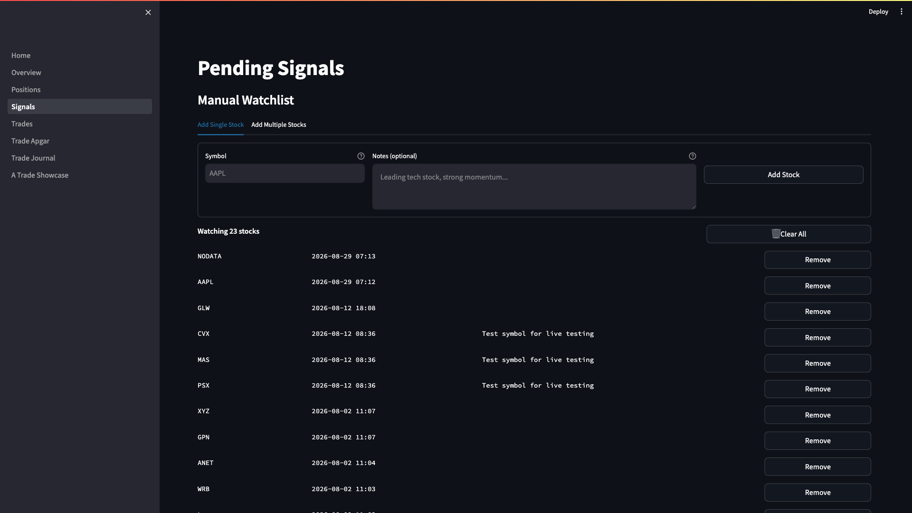
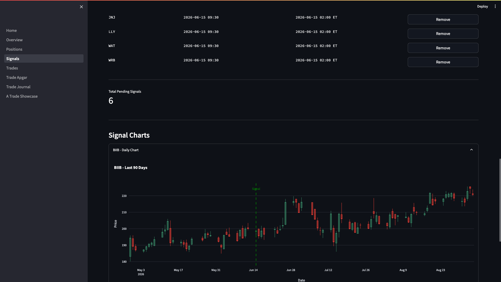
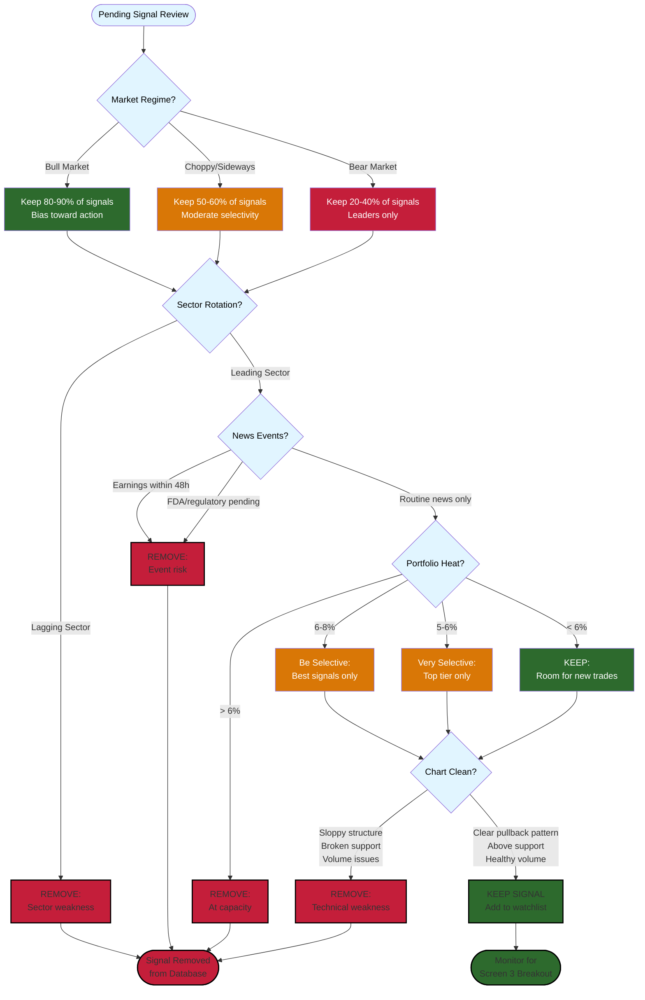

# Daily Signal Removal User Guide

**Version:** 1.0 | **Last Updated:** 2026-09-08 | **Audience:** Triple Screen Trader

---

## Overview

Each morning, the system generates pending signals for stocks that pass Screen 1 (weekly trend) and Screen 2 (daily pullback). Before these signals can trigger trades, you must review them and remove any you don't want to trade. This discretionary filtering is your last line of defense before capital is deployed.

**Use this guide to:**
- Review overnight signals each morning before market open
- Apply discretionary judgment to filter signal quality
- Remove unwanted signals from the pending queue
- Verify your daily watchlist is clean before trading begins

---

## Quick Start

**Goal:** Clean your signal queue in 10 minutes before 9:30 AM ET

1. **Navigate** to dashboard → **Signals** page (9:00-9:20 AM ET)
2. **Review** each pending signal in the "Signals Awaiting Breakout" section
3. **Click "Remove"** next to any signal you want to cancel
4. **Verify** remaining signals are stocks you're willing to trade

**Result:** A curated list of high-probability signals ready for Screen 3 breakout monitoring

---

## Step-by-Step Instructions

### Task 1: Access Pending Signals Dashboard

**Purpose:** View all signals generated overnight that passed Screen 1 + Screen 2

**Steps:**

1. **Open the Triple Screen dashboard** in your browser (bookmark: `http://your-vps-ip:8501`)

   **Look for:** Password prompt on first visit

2. **Navigate to the Signals page** using the sidebar menu

   Click **"3_Signals"** in the left navigation pane

   **Look for:** Two main sections:
   - "Manual Watchlist" (top)
   - "Signals Awaiting Breakout" (bottom)

3. **Scroll to "Signals Awaiting Breakout" section**

   **Look for:** Table showing:
   - Symbol (e.g., AAPL, MSFT)
   - Signal Date (when Screen 1+2 passed)
   - Expires At (24-hour expiration time)
   - Remove button (for each signal)

   

**Result:** You see all pending signals waiting for Screen 3 breakout. Count shown as "Awaiting Breakout: X Signals"

---

### Task 2: Evaluate Each Signal for Quality

**Purpose:** Apply discretionary judgment to filter out low-probability setups

**Steps:**

1. **Check market classification** (determine current market regime)

   Ask yourself:
   - **Bull market?** Favor all signals, bias toward holding
   - **Bear market?** Be highly selective, remove marginal signals
   - **Choppy/sideways?** Remove weaker stocks, favor leaders only

   **Tip:** Use market indices (SPY, QQQ) weekly trend as classification guide

2. **Review sector rotation and industry strength**

   For each signal, consider:
   - **Is this sector leading?** Technology rallying while energy lagging?
   - **Is the industry hot?** AI stocks outperforming semiconductors?
   - **Recent sector rotation?** Money flowing into/out of this area?

   **Action:** Remove signals from lagging sectors during rotation

3. **Check for recent news or earnings events**

   Red flags to remove:
   - **Earnings tomorrow** (volatility risk, wait for results)
   - **FDA approval pending** (binary event risk)
   - **Lawsuit headlines** (negative catalyst)
   - **CEO departure** (leadership uncertainty)

   **Tip:** Use your broker's news feed or financial news sites (no need for deep research, just scan headlines)

4. **Verify signal chart looks clean**

   Click **"Daily Chart" expander** below the signals table to view candlestick chart

   

   **Look for:**
   - Clear pullback pattern (not just a 1-day dip)
   - Pullback held above key support (not breaking down)
   - Volume profile looks healthy (no huge volume spikes on down days)

   

   **Remove if:**
   - Chart looks sloppy (wide-ranging bars, no structure)
   - Pullback violated major support levels
   - Volume drying up (potential trend exhaustion)

5. **Check position size and portfolio heat**

   **Ask yourself:**
   - Can I afford this position size? (check entry price × shares)
   - Do I have capital available?
   - Am I approaching max portfolio heat (6% total risk)?

   **Action:** Remove signals if you're at risk capacity limits

   **Note:** System calculates position size automatically, but you control final approval

**Result:** Mental checklist completed for each signal. Confidence level assigned (keep/remove).

---

### Task 3: Remove Unwanted Signals

**Purpose:** Delete signals you don't want to trade before Screen 3 monitoring begins

**Steps:**

1. **Locate the signal to remove** in the "Signals Awaiting Breakout" table

   **Look for:** Four-column layout:
   - Symbol
   - Signal Date
   - Expires At
   - Remove button (far right)

2. **Click the "Remove" button** next to the unwanted signal

   **Expected behavior:** Signal row disappears, success message appears:

   "Cancelled signal for [SYMBOL]"

3. **Repeat for all signals you want to cancel**

   **Tip:** Work through the list top to bottom to avoid missing any

4. **Review the page after each removal**

   **Look for:** Updated count: "Awaiting Breakout: X Signals" decreases by 1

**Result:** Unwanted signals removed from database. They will not trigger trades even if Screen 3 breakout occurs.

---

### Task 4: Verify Removals and Final Review

**Purpose:** Confirm your daily watchlist is clean and accurate before trading

**Steps:**

1. **Check the updated signal count** at the top of the "Signals Awaiting Breakout" section

   **Expected:** Count matches your mental tally of signals you kept

2. **Scan remaining signals one more time**

   **Final check:**
   - Would I be OK if all these trades triggered today?
   - Do I trust each setup enough to risk capital?
   - Am I mentally prepared to manage these positions?

   **Action:** Remove any last-minute doubts now (easier to cancel than close a bad trade)

3. **Note the expiration times** (displayed in ET timezone)

   **Look for:** "Expires At" column showing 24-hour countdown

   **Understanding:** Signals expire at 9:30 AM ET tomorrow if not triggered today

4. **Check time remaining before market open**

   **Deadline:** Complete signal removal by **9:25 AM ET** (gives 5 minutes buffer)

   **If running late:** Remove all signals and start fresh (better safe than sorry)

**Result:** Clean signal queue ready for Screen 3 monitoring. You're confident in every remaining signal.

---

### Task 5: Monitor Remaining Signals During Trading Day

**Purpose:** Understand what happens after you approve signals

**Steps:**

1. **No action required during market hours** (system monitors automatically)

   The system will:
   - Monitor hourly candles for Screen 3 breakout (close > signal day high)
   - Place limit orders when breakout detected
   - Convert pending signals to live positions
   - Send email alerts on execution

2. **Check dashboard mid-day** (optional, around 12:00 PM ET)

   **Navigate to:** Positions page (sidebar menu)

   **Look for:** New positions from today's signals (if Screen 3 triggered)

3. **Review end-of-day** (after 4:00 PM ET market close)

   **Check:**
   - Which signals triggered? (now in Positions page)
   - Which signals expired? (removed from Signals page)
   - Any execution issues? (check email alerts)

**Result:** You understand the full signal lifecycle from morning review to trade execution.

---

## Tips & Best Practices

💡 **Tip:** Set a calendar reminder for 9:00 AM ET daily. Make signal review a non-negotiable routine.

💡 **Tip:** Start conservative. When learning the system, remove signals liberally. As you gain confidence, keep more signals.

💡 **Tip:** Keep a trading journal. Note which signals you removed and why. Track if your discretion improves results over time.

💡 **Tip:** In bull markets, bias toward "when in doubt, keep it." In bear markets, "when in doubt, remove it."

💡 **Tip:** Focus on leading stocks in leading sectors. The best trades are usually obvious in hindsight.

 **Common Mistake:** Removing signals at 9:29 AM. Give yourself 10-15 minutes before market open. Rushed decisions = poor filtering.

 **Common Mistake:** Keeping all signals without review. The system generates setups, but you're the risk manager. Your discretion adds value.

 **Common Mistake:** Second-guessing removals mid-day. Once you remove a signal, don't re-add it manually. Trust your morning judgment.

---

## Decision Criteria Reference

## Signal Filtering Decision Flowchart

Use this visual guide to systematically evaluate each pending signal:



---

### Market Classification Framework

| Market Regime | Signal Filtering Approach | Example Action |
|---------------|---------------------------|----------------|
| **Bull Market** | Keep most signals, bias toward action | Keep 80-90% of signals |
| **Bear Market** | High selectivity, leaders only | Keep 20-40% of signals |
| **Choppy/Sideways** | Moderate selectivity | Keep 50-60% of signals |

**How to classify:** Check SPY/QQQ weekly Elder Impulse color
- GREEN impulse = Bull
- RED impulse = Bear
- BLUE impulse = Choppy

---

### Sector Rotation Checklist

**Keep signals when:**
-  Sector showing relative strength vs market
-  Industry group outperforming broader sector
-  Recent institutional money flow into sector
-  Sector rotation favors this area (e.g., tech during growth phase)

**Remove signals when:**
- ❌ Sector underperforming market (relative weakness)
- ❌ Industry showing distribution (selling pressure)
- ❌ Rotation away from this sector (money flowing elsewhere)
- ❌ Sector at extreme overbought levels (late to party)

---

### News Event Risk Assessment

**Automatic removals (high risk):**
- Earnings report within 48 hours (before or after)
- FDA/regulatory decision pending
- Merger/acquisition announcement
- Executive scandal or lawsuit headlines
- Dividend ex-date tomorrow (gap risk)

**Case-by-case judgment (moderate risk):**
- Analyst upgrades/downgrades (assess credibility)
- Product launch announcements (bullish if confirmed)
- Contract wins or customer announcements (bullish)
- Industry conference presentations (usually neutral)

**Generally OK to keep (low risk):**
- Routine industry news (no company-specific catalyst)
- Macro news affecting all stocks equally
- Technical analyst commentary
- General market volatility (VIX movements)

---

### Portfolio Heat Management

**Current heat calculation:**
```
Heat = Sum of (Initial Risk × Position Size) for all open positions
Max Heat = 6% of account value
```

**Signal removal rules:**
- **Heat < 6%:** Keep signals freely (room for new trades)
- **Heat 6-8%:** Be selective (approaching limits)
- **Heat 5-6%:** Keep only best signals (near capacity)
- **Heat > 6%:** Remove ALL signals (wait for exits to free up risk)

**Example:**
```
Account: $100,000
Max Heat: $10,000
Current open positions using: $6,500 (6.5%)
Available heat: $3,500

New signal: AAPL
Entry: $175, Stop: $170, Risk per share: $5
Position size: 140 shares
Signal heat: 140 × $5 = $700

Action: Keep (within available heat)
```

---

## Troubleshooting

**Problem:** No signals showing in "Signals Awaiting Breakout" section

**Solution:**
- Check if overnight scan ran successfully (SOP-004: Email Alert Response)
- Verify stocks are in Manual Watchlist (top section of Signals page)
- Confirm market conditions allow signals (check Screen 1/2 criteria)
- Review logs on VPS if issue persists (SOP-002: Log Monitoring)

---

**Problem:** Signal disappeared before I could review it

**Solution:**
- Signals expire after 24 hours automatically
- Check signal_date column: if yesterday, it expired overnight
- Add stock back to watchlist for tomorrow's scan if still interested
- This is normal behavior: prevents stale signals from triggering

---

**Problem:** Clicked "Remove" by accident, want to restore signal

**Solution:**
- **Cannot undo removals** (database delete is permanent)
- Re-generation requires another Screen 1 + Screen 2 setup
- If stock still qualifies, it will generate a new signal tomorrow
- Lesson: Review carefully before clicking Remove

---

**Problem:** Dashboard showing signals from previous days

**Solution:**
- This should not happen (signals auto-expire after 24 hours)
- Check system time on VPS (SOP-001: VPS Service Management)
- Manually remove stale signals using Remove button
- Report to administrator if expiration logic failing

---

## FAQ

**Q: What time should I complete signal removal?**

A: Finish by 9:25 AM ET to give yourself a 5-minute buffer before market open at 9:30 AM ET. Start at 9:00 AM for a comfortable review pace.

**Q: Can I remove signals after market open?**

A: Yes, but risky. Screen 3 monitoring begins at 9:30 AM. A signal could trigger before you remove it. Complete removals BEFORE 9:30 AM.

**Q: How many signals should I keep each day?**

A: Depends on market regime and your risk capacity. Typical ranges:
- Bull market: 3-8 signals
- Choppy market: 2-5 signals
- Bear market: 1-3 signals (or zero if nothing compelling)

Quality over quantity. Better to skip a day than force marginal trades.

**Q: What if I'm traveling or unavailable before market open?**

A: Three options:
1. **Review signals night before** (9:00 PM ET after scan completes)
2. **Set up mobile access** to dashboard (requires VPN if enabled)
3. **Manually clear all signals** if you can't review (better safe than auto-trading without oversight)

**Q: Do I need to review signals on weekends?**

A: No. Signal scans run Monday-Friday only. Signals generated Friday expire Saturday if not triggered Friday.

**Q: Can I add my own manual signals (not from scan)?**

A: Not currently supported. All signals must pass Screen 1 + Screen 2 algorithmic filters. You can influence this by managing your Manual Watchlist (top section of Signals page).

**Q: What happens if I keep all signals without removing any?**

A: System will attempt to trade all signals that trigger Screen 3. This increases:
- Portfolio heat (risk of exceeding 6% limit)
- Position correlation (multiple stocks from same sector)
- Mental load (more positions to manage)

Discretionary filtering improves win rate and reduces drawdowns.

---

## Related Guides

**Prerequisites:**
- GUIDE-001: Weekly Setup (how signals are generated)
- SOP-004: Email Alert Response (understanding signal notifications)

**Next Steps:**
- GUIDE-004: Position Monitoring (managing trades after entry)
- GUIDE-005: Exit Management (three-screen exit strategy)

---

## Glossary

| Term | Definition |
|------|------------|
| **Pending Signal** | Stock that passed Screen 1 (weekly trend) + Screen 2 (daily pullback), awaiting Screen 3 breakout |
| **Signal Expiration** | Automatic deletion of signal after 24 hours if Screen 3 doesn't trigger |
| **Discretionary Filter** | Human judgment applied to algorithmic signals (you removing unwanted setups) |
| **Portfolio Heat** | Total risk across all open positions (max 6% of account) |
| **Screen 3 Breakout** | Hourly candle close above signal day high (entry trigger) |
| **Market Regime** | Current market classification (bull/bear/choppy) based on weekly trend |
| **Sector Rotation** | Capital flowing between market sectors (e.g., tech → energy) |
| **Leading Stocks** | Stocks outperforming their sector and the broader market |

---

## Change Log

| Date | Version | Author | Changes |
|------|---------|--------|---------|
| 2026-09-08 | 1.0 | IB | Initial creation |

---

**Document Owner:** Ian Butler
**Review Frequency:** Quarterly or after UI changes
**Feedback:** Open GitHub issue or contact via project channels
