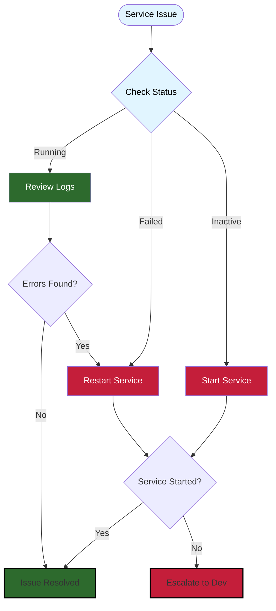

# VPS Command Reference Card

**Version:** 1.0 | **Last Updated:** 2026-09-08

---

## Service Management

| Task | Command | Example |
|------|---------|---------|
| Check service status | `systemctl status [service]` | `systemctl status triple-screen-orchestrator` |
| View all Triple Screen services | `systemctl list-units "triple-screen-*"` | Shows all running services |
| Start service | `sudo systemctl start [service]` | `sudo systemctl start triple-screen-api` |
| Stop service | `sudo systemctl stop [service]` | `sudo systemctl stop triple-screen-orchestrator` |
| Restart service | `sudo systemctl restart [service]` | `sudo systemctl restart triple-screen-dashboard` |
| Enable auto-start | `sudo systemctl enable [service]` | `sudo systemctl enable triple-screen-orchestrator` |
| Disable auto-start | `sudo systemctl disable [service]` | `sudo systemctl disable triple-screen-data-verify` |

**Available Services:**
- `triple-screen-orchestrator` - Live trading execution
- `triple-screen-dashboard` - Web dashboard
- `triple-screen-daily-data` - Daily data refresh
- `triple-screen-data-verify` - Data validation
- `ibgateway` - Interactive Brokers Gateway

---

## Log Viewing

| Task | Command | Example |
|------|---------|---------|
| View recent logs | `journalctl -u [service] -n 100` | Last 100 lines |
| Follow logs in real-time | `journalctl -u [service] -f` | `journalctl -u triple-screen-orchestrator -f` |
| Logs since time | `journalctl -u [service] --since "10 min ago"` | Last 10 minutes |
| Logs for date range | `journalctl -u [service] --since "2026-09-08 09:00"` | Specific time |
| Logs with errors only | `journalctl -u [service] -p err` | Priority: error |
| View service file logs | `tail -f /var/log/triple-screen/[service].log` | `tail -f /var/log/triple-screen/orchestrator.log` |
| View error logs | `tail -f /var/log/triple-screen/[service]-error.log` | Stderr output |

**Time Formats:**
- `"10 min ago"`, `"1 hour ago"`, `"yesterday"`
- `"2026-09-08"`, `"2026-09-08 09:00:00"`
- `"today"`, `"now"`

**Log Locations:**
- Service logs: `/var/log/triple-screen/`
- System logs: `journalctl -u [service]`
- Application logs: `/opt/triple-screen/backend/logs/`

---

## Database Connections

| Task | Command | Example |
|------|---------|---------|
| Connect to market database | `export PGPASSWORD=<pw>`<br>`psql -U triple_screen -d supertrader_market` | Interactive SQL shell |
| Connect to trading database | `export PGPASSWORD=<pw>`<br>`psql -U triple_screen -d supertrader_trading` | Trading data |
| Quick query | `psql -U triple_screen -d [db] -c "SQL"` | `psql -U triple_screen -d supertrader_market -c "SELECT COUNT(*) FROM daily_prices;"` |
| List databases | `psql -U triple_screen -l` | Show all databases |
| Show tables | `psql -U triple_screen -d [db] -c "\dt"` | List tables in database |

**Example Query:**
```bash
# Count today's price data
psql -U triple_screen -d supertrader_market -c "SELECT COUNT(*) FROM daily_prices WHERE date = CURRENT_DATE;"
```

---

## System Health Checks

| Task | Command | Expected Output |
|------|---------|-----------------|
| Disk space | `df -h` | / > 20% free |
| Memory usage | `free -m` | Available > 500MB |
| CPU usage | `top -bn1 \| head -20` | Load < 2.0 |
| Process check | `ps aux \| grep triple-screen` | Services running |
| Network connectivity | `ping -c 3 api.ibkr.com` | 0% packet loss |
| PostgreSQL status | `sudo systemctl status postgresql` | Active (running) |
| Check all services | `systemctl list-units "triple-screen-*" --state=failed` | No failed units |

**Quick Health Script:**
```bash
# Run all health checks at once
echo "=== Services ==="
systemctl is-active triple-screen-orchestrator triple-screen-api triple-screen-dashboard

echo "=== Disk Space ==="
df -h | grep -E "/$|/opt"

echo "=== Memory ==="
free -h | grep Mem

echo "=== Database ==="
sudo systemctl status postgresql --no-pager | grep Active
```

---

## Process Management

| Task | Command | Example |
|------|---------|---------|
| Find Triple Screen processes | `ps aux \| grep triple-screen` | View all processes |
| Find Python processes | `ps aux \| grep python` | Backend processes |
| Kill process by PID | `sudo kill -15 [PID]` | Graceful shutdown |
| Force kill process | `sudo kill -9 [PID]` | Force termination (last resort) |
| View process tree | `pstree -p \| grep triple` | Parent/child relationships |

---

## Emergency Stop Trading

 **CRITICAL**: Use only in trading emergencies (flash crash, system malfunction, account compromise)

```bash
# 1. Stop orchestrator immediately
sudo systemctl stop triple-screen-orchestrator

# 2. Verify stopped
systemctl status triple-screen-orchestrator | grep Active
```

---

## Troubleshooting Decision Tree

```
Service won't start
  ├─ Check status: systemctl status [service]
  │   ├─ If "failed" → Check logs: journalctl -u [service] -n 50
  │   └─ If "inactive" → Try start: sudo systemctl start [service]
  ├─ Check dependencies
  │   ├─ PostgreSQL running? → systemctl status postgresql
  │   └─ Disk space available? → df -h
  └─ If still failing → Check error logs + escalate

Dashboard not responding
  ├─ Check service: systemctl status triple-screen-dashboard
  ├─ Check port: sudo netstat -tulpn | grep 8501
  ├─ Check logs: journalctl -u triple-screen-dashboard -f
  └─ Restart: sudo systemctl restart triple-screen-dashboard

Database connection fails
  ├─ PostgreSQL running? → systemctl status postgresql
  ├─ Check credentials: cat /opt/triple-screen/.env.production
  ├─ Test connection: psql -U triple_screen -d supertrader_market
  └─ Check pg_hba.conf: sudo cat /etc/postgresql/*/main/pg_hba.conf
```

---

## Service Management Flowchart

Visual guide to service troubleshooting:



---

## Key File Locations

| Item | Path |
|------|------|
| Service files | `/etc/systemd/system/triple-screen-*.service` |
| Application code | `/opt/triple-screen/backend/` |
| Virtual environment | `/opt/triple-screen/.venv/` |
| Environment config | `/opt/triple-screen/.env.production` |
| Service logs | `/var/log/triple-screen/` |
| Application logs | `/opt/triple-screen/backend/logs/` |
| PostgreSQL config | `/etc/postgresql/*/main/postgresql.conf` |
| Database access | `/etc/postgresql/*/main/pg_hba.conf` |

---

## Emergency Contacts

**Critical Issues:**
- Stop trading FIRST → `sudo systemctl stop triple-screen-orchestrator`
- System Owner: Ian Butler
- Document: Service affected, error messages, steps taken
- Escalate with logs: `journalctl -u [service] --since "1 hour ago"`

**Non-Critical:** Monitor and report during next review

---

## Related Documents

- Full SOPs: `docs/SOPs/`
- Service restart: `docs/SOPs/SOP-002-restart-services.md` (if available)
- Daily data refresh: `docs/SOPs/SOP-001-daily-data-refresh.md` (if available)
- Troubleshooting guide: `docs/troubleshooting/` (if available)

---

**Document Owner:** Ian Butler
**Feedback:** Open GitHub issue or contact via project channels
**Review Frequency:** Monthly or after system changes
